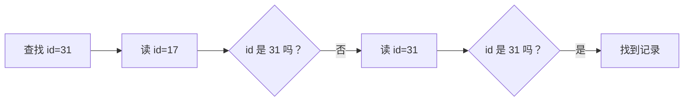
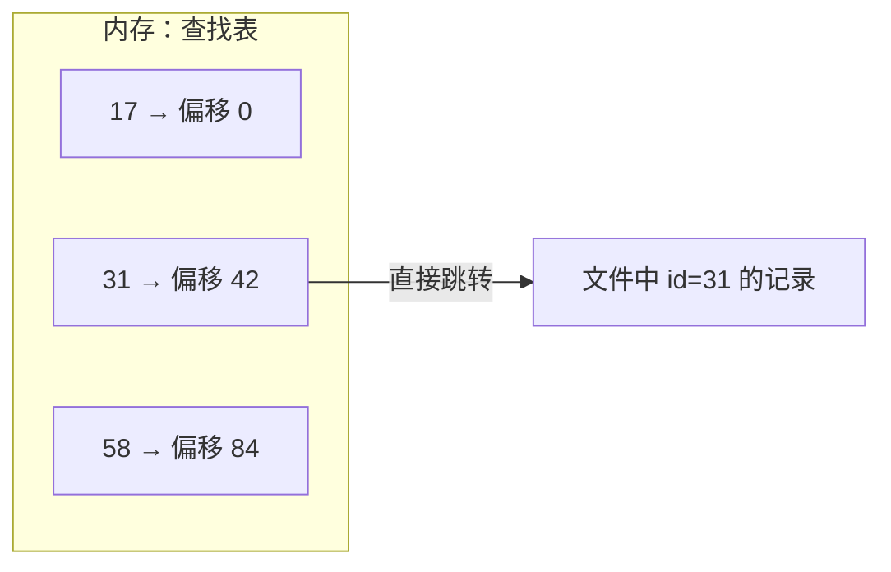
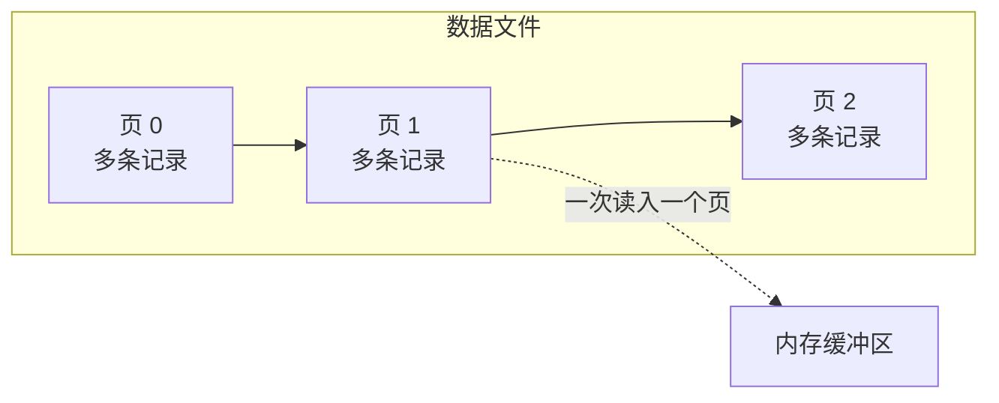

## 问题：怎样保存一条用户记录？

假设我们要保存用户的 `id`、`name` 和 `email`。程序退出后，数据必须还在；下次启动时，我们还要能按 `id` 找到用户。

先只处理一个问题：**怎样把记录放进文件，并找到指定的那条？** 暂时不讨论更新中断或多个请求同时写入。那些问题会在我们先拥有一个可用存储结构后再出现。

## 尝试：把记录追加到文件

从三条记录开始。每当新用户到来，就把编码后的记录追加到文件末尾：

```text
id=17, name=安, email=an@example.test
id=31, name=博, email=bo@example.test
id=58, name=晨, email=chen@example.test
```

假设现在要找 `id=31`。文件没有告诉我们第二条记录在哪里；最直接的办法是从头读，逐条检查：



> **先停一下**
>
> 如果目标恰好是文件里的最后一条，这次查找最多要检查几条记录？如果有一百万条记录呢？

追加让写入很简单，但查找要从文件开头一路扫到目标。记录数扩大十倍，最坏情况下要检查的记录也扩大十倍。

## 再试一次：记住记录的位置

刚才扫描时，我们其实发现了每条记录的位置。那能不能记住 `id` 对应的文件偏移，下次直接跳过去？



这让查找变快了，但现在关掉程序再重启：文件还在，内存中的位置表却不在了。我们可以重新扫描文件来重建它，可启动时仍要读完所有记录。

> **轮到你判断**
>
> 如果把这张位置表也写进另一个文件，重启后就能直接使用了吗？想想那张表在插入、删除或文件搬动后怎样保持正确；如果它写到一半遇到故障，又该怎样判断哪些位置有效。

把问题放到另一份文件里，并没有让它消失。我们需要一种能持久保存、能更新、也能高效查找的结构。下一课会从这里继续推出索引。

## 发现：文件读写有合适的粒度

在引入索引前，还要先解决一个更基础的问题：每次查找都只读一条记录，合适吗？

存储设备和操作系统通常按块搬运数据。如果一条记录只有几十或几百字节，为它单独发起一次随机读取，寻址和 I/O 固定开销可能比处理记录本身更贵。既然一次读已经搬来一整块空间，我们可以把多条记录放在一起，并以这一块作为读取、缓存和写回的单位。

这块固定大小的空间就是**页**。页把磁盘 I/O 和内存缓冲连接起来：存储引擎按页读写，缓冲池也按页缓存。



页解决了“以多大单位组织读写”的问题，但没有替我们回答“目标记录在哪个页”。即使记录已经放进页里，最坏情况仍可能要逐页扫描。页是索引等更高层结构的基础，不是快速查找本身。

## 小实验：在纸上排一个页

现在只看一个 4096 字节的页。先假设页头占 64 字节，用户记录长度不固定。

预测一下：如果每条记录内容从页头后依次紧挨着写，删掉中间一条后，后面的记录怎么办？

一种常见布局是：页头和槽目录从页的一端增长，记录内容从另一端反向增长，中间留下空闲空间。槽目录记录每条记录在页内的位置；移动记录内容时，可以更新槽里的位置，而不必让上层一直依赖易变的字节偏移。


页内布局需要同时考虑记录定位、空闲空间和变长记录。删除时可以留下空洞，稍后整理；也可以立即移动后面的内容。前者会产生碎片，后者会增加写入并改变位置。实际实现要在稳定引用、空间利用率和写入成本之间取舍。

## 下一道压力：怎样少读页？

现在我们有了文件、页和页内记录布局，但查找 `id=31` 仍可能从第一页开始逐页检查。要避免扫描，就需要额外的导航结构；而这结构本身也必须持久化并随数据变化。

下一课从“怎样少读页”继续，逐步推出索引和 B+ 树，并检查它们为什么能加快查找、又给写入带来什么代价。

## 重建题

合上正文，从三条用户记录开始解释：

1. 为什么追加文件容易写，却可能让查找变慢？
2. 记住 `id → 文件偏移` 为什么不能直接解决重启后的查找？
3. 为什么需要页作为读写与缓存单位？页又留下了什么问题？

## 自检

- [ ] 能用三条记录说明追加文件如何查找，以及最坏情况为何要扫描到末尾。
- [ ] 能解释内存位置表为什么重启后失效，把它写盘又会引出什么维护问题。
- [ ] 能说明页是 I/O 与缓存管理单位，不是“数据库里的一行”。
- [ ] 能指出页内布局要处理记录位置、空闲空间和变长记录。
