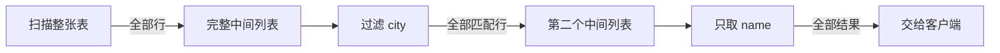
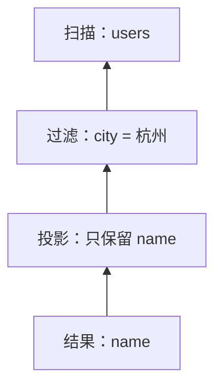
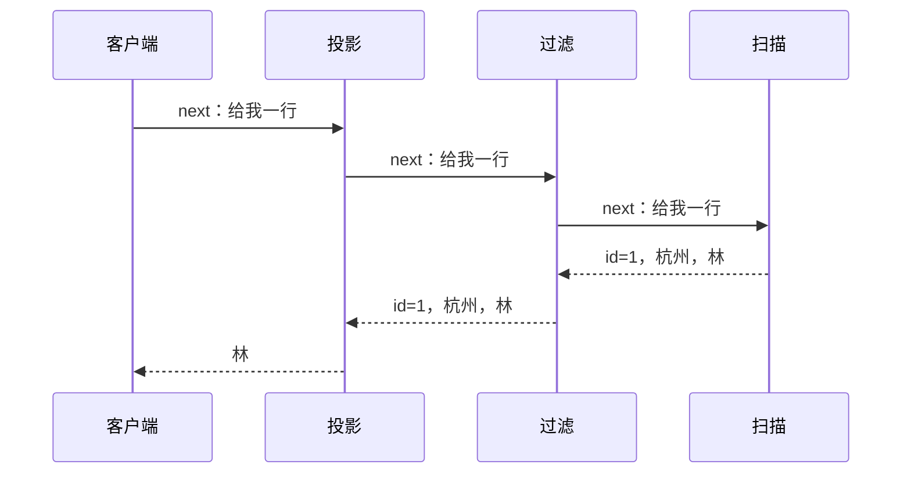
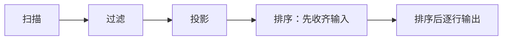

## 问题：执行计划写着步骤，谁来一步步完成它？

上一课里，我们把一条查询变成了计划：扫描 `users`，筛出杭州用户，再只取 `name`。计划说明要做哪些操作，却还没有告诉我们这些操作怎样配合、怎样把结果交给下一步。

继续使用这个例子。表里按存储顺序有三行：

| id | city | name |
|---:|---|---|
| 1 | 杭州 | 林 |
| 2 | 上海 | 苏 |
| 3 | 杭州 | 周 |

```sql
SELECT name
FROM users
WHERE city = '杭州';
```

先自己写下结果，再想：如果表里有一亿行，数据库是不是必须先把一亿行都装进内存，才能交出第一行结果？

## 尝试：每一步都做完，再交给下一步

最直观的实现是：扫描器先把整张表读成一个列表，过滤器再遍历列表、做出第二个列表，最后投影算子做出只包含名字的第三个列表。



这种做法能得到正确结果。规模很小时，它也很好理解。现在把表扩大到一亿行：中间列表要占多少内存？客户端如果只想先显示第一页，为什么必须等所有行都处理完？

问题出在我们把“一个操作完成”理解成“处理完整个输入”。很多操作其实可以边读边算：扫描器交出一行，过滤器检查这一行，投影器立刻整理通过的列。

## 发现：操作可以逐行协作

把计划画成一棵树。叶子从表里取行，父节点拿到子节点的一行后再做自己的工作：



图里的箭头先表示“谁依赖谁”：投影需要过滤的输出，过滤需要扫描的输入。接下来还有一个关键问题：这一行是谁向谁要来的？

暂停一下，想两种可能：扫描器主动把每行推给上层，还是上层需要下一行时再向下层请求？在第一种方式中，若上层暂时处理不过来，数据会堆在哪里？

## 推导：从根节点请求下一行

采用一种简单的协作约定：每个节点都提供 `next()`。上层调用子节点的 `next()`，要一行；子节点再向自己的子节点要行。若节点已经没有输出，就返回“结束”。

因此客户端要一行结果时，请求从计划树顶端向下传；数据则从表扫描处一层层向上返回：



用同一张表，跟踪两次请求。第一次，扫描器读出 `id=1`；过滤器检查城市，发现它匹配，于是把这一行交给投影器，投影器只留下“林”。第二次，过滤器读到 `id=2`，发现城市不匹配，就在内部继续请求下一行；读到 `id=3` 后，才把“周”交上来。

这里 `id=2` 没有变成查询结果，但它仍然被扫描和检查了。**被读取的行数**和**最终返回的行数**不是一回事，这也是看实际执行统计时要分清的两种数量。

```text
扫描器：id=1 ──→ 过滤器通过 ──→ 投影器输出“林”
扫描器：id=2 ──→ 过滤器丢弃
扫描器：id=3 ──→ 过滤器通过 ──→ 投影器输出“周”
```

## 概念：迭代器与拉取式执行

刚才我们构造的约定可以概括为：每个执行节点按需返回下一行；父节点从子节点拉取输入。这类逐行拉取的执行方式常称为**迭代器模型**，也常与 Volcano 风格执行联系起来。

过滤节点的简化逻辑如下：

```text
next():
    重复：
        row = child.next()
        如果 row 已结束：返回结束
        如果 row.city 等于“杭州”：返回 row
```

投影节点每次从过滤节点取一行，再只返回 `name`。如果执行计划顶端还有 `LIMIT 1`，它拿到第一行后就不再请求第二行；下面的节点因此可能少做工作。没有 `ORDER BY` 时，SQL 不保证是哪一行先出现，所以这里说的是“可以停止请求”，不是承诺某个固定用户先返回。

## 新压力：有些操作不能读一行就立刻产出

逐行协作能让扫描、过滤和投影像流水线一样工作，但不是所有操作都能马上输出。比如要按 `name` 排序，数据库在知道全体输入前，通常无法确定哪行应该排第一；哈希连接也要先把一侧输入建成哈希结构，之后才能用另一侧探测匹配项。

这类需要先消费一批甚至全部输入、才能开始输出的节点，会形成流水线的边界：



所以“迭代器”并不代表每个节点都只保存一行，也不代表执行过程完全不占内存。它描述节点如何请求与交付结果；排序、哈希表、物化子查询等节点仍可能保存很多数据，内存不足时还会引出临时文件和额外 I/O。

另一个代价是逐行调用本身有成本。若每次函数调用只处理一行，而行数极大，调度和表达式计算的开销可能变得明显。某些执行器会按批次或向量处理多行，以减少逐行开销；这改变了每次处理的数据量，但并没有消除算子之间的数据依赖。

## 实现印证：在执行计划里寻找节点

概念模型不是所有数据库内部代码的完整描述。PostgreSQL 18 的执行器文档明确描述了计划节点按需求递归拉取行，并以排序节点说明：排序要先消费子节点的全部输入，再交出首行。[PostgreSQL 18 执行器文档](https://www.postgresql.org/docs/18/executor.html)

MySQL 8.0 从 8.0.20 起以迭代器执行器替换此前执行器；`EXPLAIN ANALYZE` 会按执行迭代器报告估算和实际行数、循环次数及时间等信息。[MySQL 8.0 更新说明](https://dev.mysql.com/doc/refman/8.0/en/mysql-nutshell.html) · [MySQL 8.0 EXPLAIN ANALYZE](https://dev.mysql.com/doc/refman/8.0/en/explain.html)

读实际计划时，试着对每个节点问：它从哪里取输入？它产出多少行？它会循环多少次？第一次输出前是否必须等输入全部到齐？这些问题能把计划树变成对实际工作的解释。

## 小练习：预测节点调用

表的扫描顺序为 `杭州、上海、杭州、杭州`。计划是 `扫描 → 过滤杭州 → 投影 name`，客户端连续请求两行结果。

先写下：扫描器总共要交出几行？过滤器检查几行？投影器返回几行？再在脑中模拟第三次请求时，各节点会发生什么。

<details>
<summary>逐步核对</summary>

第一次结果需要扫描前两行：第一行通过并返回；第二行不通过，过滤器继续向扫描器要第三行，第三行通过。第二次结果因此总共需要扫描三行、检查三行，投影并返回两行。第三次请求从第四行继续，若它也匹配就再返回一行；之后下一次请求才会发现扫描结束并向上层传递结束信号。

</details>

## 下一道压力：执行到一半发生故障

现在我们知道了查询计划怎样逐步产出结果。但数据库也要执行 `UPDATE`、`INSERT` 和 `DELETE`。如果更新已经改了几个页，进程突然崩溃，重启后怎样分辨哪些修改应该保留、哪些必须撤销？

这会把我们带到写入日志与崩溃恢复：从“执行节点做了什么”继续追问“故障后怎样恢复成合法状态”。

## 重建题

不看正文，从 `扫描 → 过滤 → 投影` 这条计划开始说明：

1. 为什么先构造完整中间结果可能浪费内存并延迟首行？
2. `next()` 如何让父节点向子节点拉取行？
3. 过滤器跳过不匹配行时，扫描行数和返回行数有什么区别？
4. 排序为什么会打断逐行流水线？

## 自检

- [ ] 能从同一张三行用户表逐步模拟两次 `next()` 请求。
- [ ] 能区分节点间的数据方向与请求方向。
- [ ] 能说明拉取式执行支持提前停止的条件，并指出 `ORDER BY` 对结果顺序的影响。
- [ ] 能举例说明为什么排序或哈希连接需要保存中间状态。
