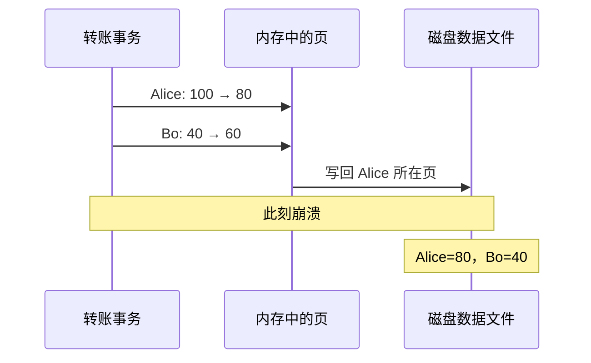
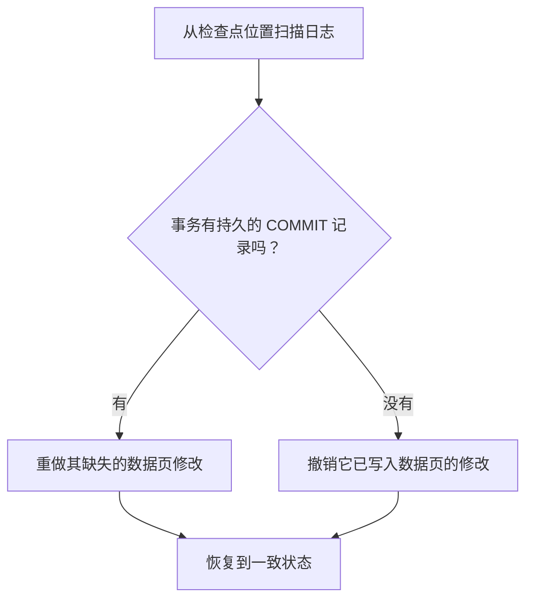
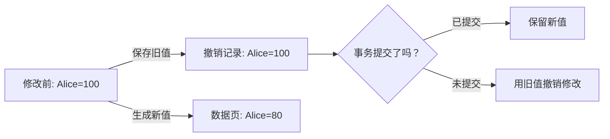

## 问题：一次转账，必须一起成功或一起失败

Alice 账户有 100 元，Bo 账户有 40 元。现在转 20 元：Alice 扣 20，Bo 加 20。转账前后总额都应是 140 元。

```sql
BEGIN;
UPDATE accounts SET balance = balance - 20 WHERE name = 'Alice';
UPDATE accounts SET balance = balance + 20 WHERE name = 'Bo';
COMMIT;
```

这里用两条语句描述一个业务动作；应用会把它们放在同一个事务中。期待的状态只有两个：转账前 `(100, 40)`，或转账后 `(80, 60)`。如果重启后看到 `(80, 40)`，钱少了 20 元；看到 `(100, 60)`，钱多了 20 元。

先想想：两行很可能位于不同的数据页。数据库先改完 Alice 所在页，再改 Bo 所在页。如果进程在两次写入之间崩溃，磁盘上可能留下什么？

## 尝试：直接改数据页

存储引擎通常先把数据页读入内存，在内存中修改，再由后台或前台时机写回文件。先假设两行在不同页：



**暂停一下**：如果服务此时已向客户回答“转账成功”，这个结果可以接受吗？即使服务还没回答，重启后又怎样知道那一半修改该保留还是撤销？

问题有两层：事务的多项修改要保持**原子性**，成功答复过的修改还要有**持久性**。仅仅把两页都写回，并不能把两个独立的磁盘写合成一个原子动作；若每次提交都强制改写所有数据页，写入量和随机 I/O 也会很大。

## 发现：先记录“准备怎样改”

再试一个方案：不立刻把新值写进数据文件，而是先把这次事务要做的修改顺序追加到另一份文件：

```text
T7  BEGIN
T7  Alice.balance = 80
T7  Bo.balance = 60
T7  COMMIT
```

这是教学用的简化日志格式。关键是它记录了足以恢复的修改，并有明确的提交标记。现在先假设日志真的已经安全落盘，再允许对应的数据页稍后写回。

这引出一个顺序约束：**数据页写入持久存储之前，描述该修改的日志记录必须先持久化。** 这就是写前日志（Write-Ahead Logging，WAL）的核心规则。PostgreSQL 18 的文档也把 WAL 概括为：描述修改的日志记录要先刷到持久存储，数据文件中的修改之后才能写入；崩溃后可以从日志重做尚未落到数据页的修改。[PostgreSQL 18：WAL](https://www.postgresql.org/docs/18/wal-intro.html)

另外，若数据库要在提交后立即向客户端承诺“即使突然断电也保留”，`COMMIT` 记录也必须在答复前按配置要求持久化。写入系统调用已经返回，不一定等于数据已经抵达稳定存储；操作系统缓存、设备缓存和数据库的提交配置都会影响这个边界。

## 推导：沿着崩溃时刻逐个检查

为了只关注恢复逻辑，先假设这份小日志能被正确识别，且每条重做记录是“把余额设为某个值”。然后逐个看崩溃发生在哪里：

| 崩溃时刻 | 重启时能确认什么 | 恢复目标 |
|---|---|---|
| Alice 的数据页已改，提交记录尚未持久化 | 没有持久提交证据 | 事务不应被当作成功 |
| 提交记录已持久化，两个数据页都还没写回 | 事务已提交，页仍可能是旧值 | 重做 Alice=80、Bo=60 |
| 提交记录已持久化，只有 Alice 页写回 | 事务已提交，磁盘是混合状态 | 重做缺失的 Bo=60，并确认 Alice 不会被重复扣款 |
| 两页都写回，提交记录已持久化 | 数据与日志都反映事务 | 保持 `(80, 60)` |

留意第三行的陷阱：如果日志写的是“余额减 20”，重复执行可能把 Alice 从 80 再改成 60。真正的恢复格式必须让重复应用可检测或安全；例如简化示意可以记录目标值，并给页面或日志记录带上递增的位置号。实际数据库使用更精细的物理/逻辑记录和页面版本信息，不能把上面的文本格式当作真实格式。



## 新压力：只重做还不够

刚才似乎只要重做已提交事务即可。但想象一个较长的事务：它先修改 Alice 页，后来还要修改很多页。内存吃紧时，缓冲池想腾出空间；若允许把**尚未提交事务**改过的页提前写回，崩溃后那些页也可能留在磁盘上。

一种简单规则是：没提交的脏页一律不准写回。这叫不窃取（no-steal）的简化策略；它让恢复容易，却可能让长事务占住大量脏页，限制缓冲池回收空间。

另一种策略允许把未提交事务的脏页写回磁盘。这样能灵活回收内存，但恢复时必须有办法撤销未提交修改。于是每次修改还需要保留“改之前是什么”的信息：这类信息叫**撤销记录**（undo）。



现在有了两种方向相反的信息：

- **重做信息**回答：如果已提交的修改还没完整落到数据页，怎样补上？
- **撤销信息**回答：如果未提交的修改已经落到数据页，怎样恢复旧状态？

具体系统怎样组合这些信息并不相同。不要把“WAL 一定等于某种固定日志格式”或“所有数据库都按同一个算法恢复”当成结论。

## 再一道压力：日志会一直长下去

如果每次重启都从日志开头开始扫描，运行时间越久，恢复就越慢；而且旧日志不能无限占磁盘。数据库需要周期性建立一个恢复起点：把此前必要的数据页写稳，并记录从哪里继续检查日志。这个恢复起点称为**检查点**（checkpoint）。


检查点能限制通常需要扫描和重做的日志范围，也为回收更旧的日志创造条件；检查点过久，崩溃恢复要处理的工作通常会更多。检查点不是备份：它不能让你恢复到误删发生之前，也不能替代把备份和归档日志存到独立故障域。

## 实现对照：相同压力，不同恢复细节

在 MySQL 8 的 InnoDB 中，redo log 用于崩溃恢复时重放尚未完成写入数据文件的修改；undo log 保存撤销最近修改的信息，也参与一致性读。InnoDB 在崩溃恢复时应用 redo，并回滚崩溃时仍未提交的事务。[MySQL 8.0：Redo Log](https://dev.mysql.com/doc/refman/8.0/en/innodb-redo-log.html) · [Undo Logs](https://dev.mysql.com/doc/refman/8.0/en/innodb-undo-logs.html) · [InnoDB Recovery](https://dev.mysql.com/doc/refman/8.0/en/innodb-recovery.html)

PostgreSQL 18 同样使用 WAL 保护数据文件并从日志恢复，也支持基于基础备份加归档 WAL 的时间点恢复；其 WAL 记录、检查点和事务可见性实现与 InnoDB 并不完全相同。[PostgreSQL 18：WAL 与可靠性](https://www.postgresql.org/docs/18/wal.html) · [检查点](https://www.postgresql.org/docs/18/sql-checkpoint.html) · [连续归档与时间点恢复](https://www.postgresql.org/docs/18/continuous-archiving.html)

本章只建立恢复所需的因果结构。后续引擎对照会继续检查日志格式、刷盘配置、页面写入和恢复阶段，并以对应版本文档为准。

## 小练习：给崩溃找一个合法结果

Alice 从 100 转 20 给 Bo，Bo 原有 40。恢复日志里有两条更新记录和一条 `COMMIT`。对每种情况写出重启后的余额：

1. 只有 Alice 页写回，`COMMIT` 尚未持久化。
2. `COMMIT` 已持久化，两页都未写回。
3. `COMMIT` 已持久化，Alice 页已写回，Bo 页未写回。
4. 没有 `COMMIT`，但两个新值都已经写入数据页，而且日志中保留了两个旧值。

再回答：如果日志只存 `balance -= 20` 这类相对操作，重复重做会有什么风险？

<details>
<summary>逐步核对</summary>

1. 没有持久提交证据，事务应撤销；即使 Alice 新值已经落盘，也用撤销信息回到 `(100, 40)`。
2. 提交已确认，重做两条修改，结果是 `(80, 60)`。
3. 已提交；保留 Alice=80，并重做 Bo=60，结果是 `(80, 60)`。
4. 未提交；撤销两条修改，结果回到 `(100, 40)`。

若把“减 20”重放两次，余额可能被减两次。恢复记录需要让重做能够判断某个效果是否已应用，或采用可重复应用的目标状态记录。

</details>

## 下一道压力：两个事务同时动同一行

日志能帮助单个事务跨过崩溃，但它没有回答：如果另一个事务在转账期间也修改 Alice 的余额，两个更新怎样交错？谁等谁？最后结果如何满足隔离要求？

下一课从并发操作的交错开始，逐步推出锁、隔离异常和 MVCC。

## 重建题

合上正文，从 Alice 的转账开始，解释：

1. 直接改两个数据页为什么会留下半笔转账？
2. 为什么数据页写回之前，要先让相应日志信息持久化？
3. 已提交但数据页落后时，为什么需要重做？
4. 未提交修改可能已经写回时，为什么还需要撤销信息？
5. 检查点怎样帮助限制恢复工作？它为什么不能代替备份？

## 自检

- [ ] 能区分事务原子性与提交持久性。
- [ ] 能用两行余额追踪 WAL 与数据页的安全写入顺序。
- [ ] 能说明 redo 与 undo 分别要修复哪类崩溃状态。
- [ ] 能解释检查点的恢复价值，并指出检查点不是备份。
- [ ] 能说明引擎间都使用日志，并不意味着日志格式和恢复算法相同。
