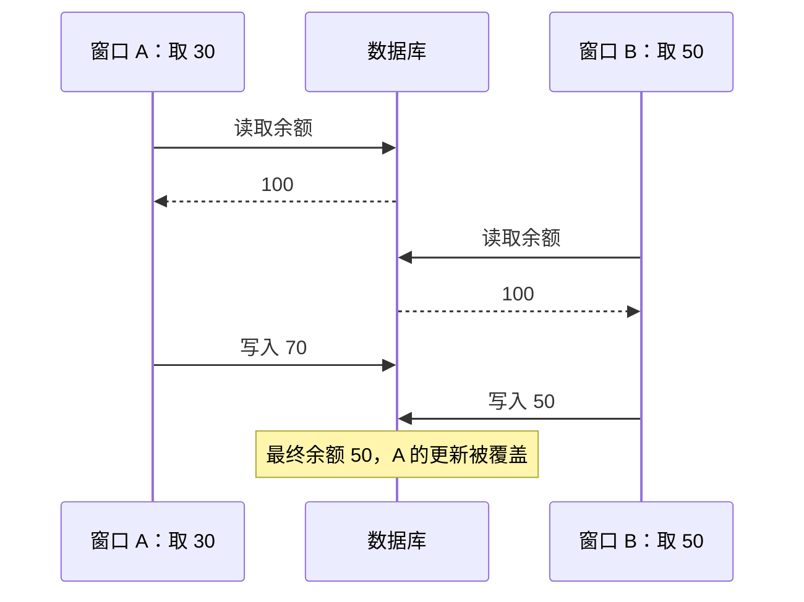
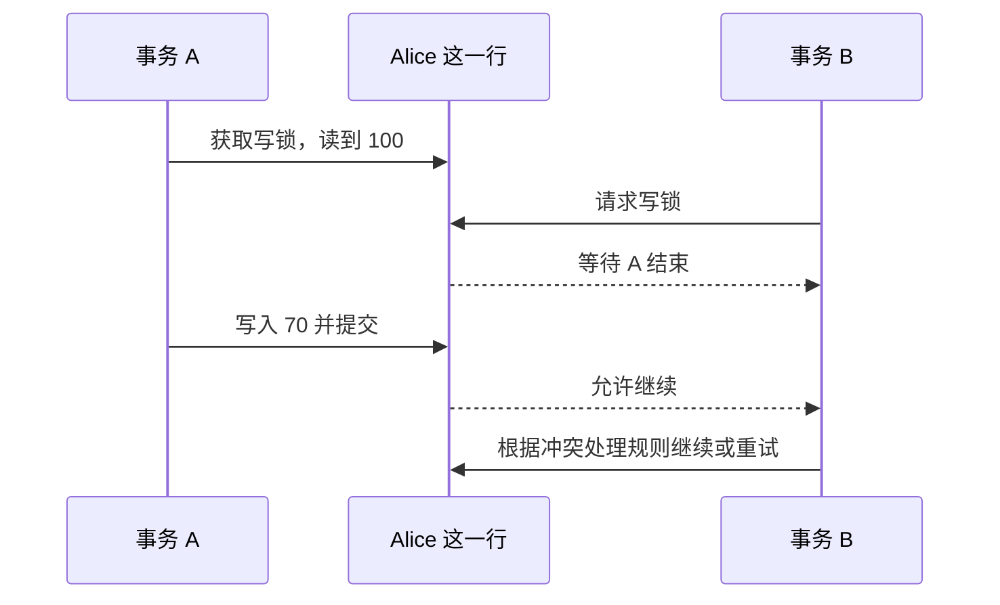
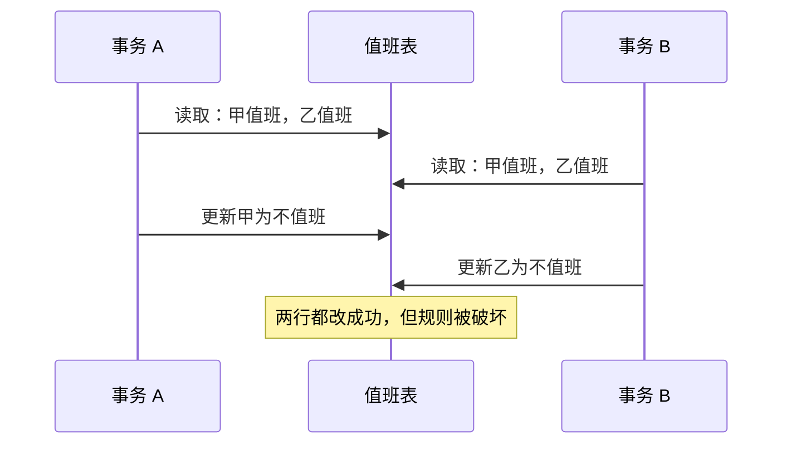

## 问题：两次取款，余额为什么少扣了一次？

Alice 账户里有 100 元。几乎同时，她在两个窗口分别发起取款：窗口 A 取 30 元，窗口 B 取 50 元。假设两次取款都允许成功，最后应剩 20 元。

先看应用层常见的“读—计算—写”方式：

```text
读取余额 → 应用计算新余额 → 把新余额写回
```

两边可能都先读到 100：A 算出 70，B 算出 50。A 把 70 写回后，B 又把 50 写回。两次请求都成功，最后却只扣了 50 元。



**先停一下**：问题出在数据库“没有锁”，还是出在应用把基于旧值算出的 50 又写了回来？如果只靠每条 SQL 单独执行正确，为什么整个取款动作仍然可能错？

## 尝试：让一个事务暂时独占这行

数据库可以在事务修改一行时，为它加一把写锁。另一个事务若也要改同一行，就必须等前一个事务提交或回滚。

再看取款流程：A 先锁住 Alice 的行，读到 100，写成 70 并提交；B 在锁上等待，之后再继续。具体数据库可能让 B 读取较新的值，也可能在某些隔离条件下拒绝 B 并要求重试；安全结果应是“基于有效状态继续”或“明确失败”，不能静默覆盖。



数据库内部常用**共享锁**和**排他锁**来表达冲突关系。共享锁适合需要互相兼容的读取；排他锁保护修改，不能与另一个冲突的锁同时持有。

| 已持有 / 新请求 | 共享锁 S | 排他锁 X |
|---|---:|---:|
| 共享锁 S | 允许 | 等待 |
| 排他锁 X | 等待 | 等待 |

这是解释锁冲突的简化矩阵。数据库真实的锁种类还包括意向锁、范围/间隙锁、表锁等；一条 SQL 可能因为它扫描的索引范围而锁住不止最终更新的那一行。

## 概念：锁把操作排成安全的次序

锁不是让并发消失，而是在冲突处规定谁先做、谁等待。数据库可以让访问不同记录的事务继续并行；只有冲突资源上的操作需要协调。

事务通常在提交或回滚时释放事务级锁。这样，其他事务不会在前一个事务还可能撤销修改时，就基于半成品继续做决定。这会带来新的代价：事务持锁越久，别的事务等待越久。

若业务先读再决定写什么，显式锁定读取可以在读取时就声明“这行接下来要参与修改”：

```sql
BEGIN;
SELECT balance FROM accounts WHERE name = 'Alice' FOR UPDATE;
-- 应用根据锁定后读到的余额计算新值，并绑定为参数 :new_balance
UPDATE accounts SET balance = :new_balance WHERE name = 'Alice';
COMMIT;
```

这是结构示意，不是可直接复用的取款实现：常量 `70` 应由本次读取计算，余额不足和重试也需要处理。`FOR UPDATE` 的锁范围、等待后的读取行为会因数据库、索引和隔离级别而不同。InnoDB 和 PostgreSQL 都提供锁定读取语法，但使用前要核对对应版本的具体规则。[MySQL 8.0 锁定读取](https://dev.mysql.com/doc/refman/8.0/en/innodb-locking-reads.html) · [PostgreSQL 18 行级锁](https://www.postgresql.org/docs/18/explicit-locking.html)

如果整个修改能写成一条基于当前行值的 SQL，通常不必先把旧值读到应用再写常量：

```sql
UPDATE accounts
SET balance = balance - 30
WHERE name = 'Alice' AND balance >= 30;
```

再检查影响行数，就可以区分“成功扣款”和“余额不足/记录不存在”。数据库仍需协调并发更新，但这种写法缩短了“读旧值后再写”的窗口。涉及多行或跨行约束时，一条原子更新未必足够。

## 新压力：锁住一行，够不够？

医院有两名值班医生，规则是“至少一人保持值班”。事务 A 检查两人都值班后，决定让医生甲下班；事务 B 也检查到两人都值班，决定让医生乙下班。



两个事务更新的是不同的行。在允许这类并发提交的隔离策略下，单纯给每一行的写入加排他锁不会让它们冲突；但两个决定都依赖“至少有一人值班”这个跨行条件。最后两人都下班，规则失效。这类“各自看起来安全，合起来却违反约束”的问题常称为**写偏斜**（write skew），属于串行化异常的一类。

这说明要先问清要保护什么：

- 如果只要避免同一行被同时改，行锁可能足够。
- 如果约束依赖一个范围、计数或多行关系，只锁当前看到的行可能不够。
- 若结果必须等价于某个串行顺序，需要更强的隔离保证，或显式锁住能够代表该约束的资源。

## 推导：隔离级别描述允许哪些交错

事务隔离级别不是“锁多一点/少一点”的简单开关。它描述并发事务允许看到哪些现象或交错；数据库可以用锁、多版本或两者结合来实现。

先区分几类现象：

| 现象 | 两步观察 | 发生了什么 |
|---|---|---|
| 脏读 | B 读到 A 尚未提交的 70；A 随后回滚 | B 读到最终不会存在的值 |
| 不可重复读 | A 两次读取同一行；中间 B 提交了修改 | A 前后读到不同值 |
| 幻读 | A 两次运行同一范围查询；中间 B 插入并提交了匹配行 | 第二次多出符合条件的新行 |
| 写偏斜/串行化异常 | 多个事务基于同一组旧观察，各自改不同记录 | 最终状态无法解释为某个合法串行顺序 |

SQL 标准用若干最低保证来刻画隔离级别。下表是概念轮廓，不能直接代替某个引擎的行为说明：

| 隔离级别 | 核心直觉 | 仍需注意 |
|---|---|---|
| READ UNCOMMITTED | 可以看到未提交修改 | 结果可能依赖后来回滚的数据 |
| READ COMMITTED | 每次读取只看已提交数据 | 同一事务重读可能变化，也可能出现范围新增 |
| REPEATABLE READ | 同一事务重复读取有更稳定的视图 | 不同实现对范围、并发写入和串行化异常的处理不同 |
| SERIALIZABLE | 已提交并发结果应等价于某个串行顺序 | 可能阻塞，也可能检测冲突并中止事务；应用要准备重试 |

“级别名称相同”不代表“内部做法和边界完全相同”。例如 MySQL 8.0 InnoDB 默认 `REPEATABLE READ`，并结合一致性读、行锁及范围锁等机制；PostgreSQL 18 的 `READ UNCOMMITTED` 实际按 `READ COMMITTED` 工作，而它的 `REPEATABLE READ` 虽然比标准最低要求更强，仍可能出现串行化异常。[InnoDB 隔离级别](https://dev.mysql.com/doc/refman/8.0/en/innodb-transaction-isolation-levels.html) · [PostgreSQL 18 事务隔离](https://www.postgresql.org/docs/18/transaction-iso.html)

## 再一道压力：等待也会形成环

锁解决了冲突操作同时写入的问题，却可能让事务互相等待。假设转账事务 A 先锁 Alice，再锁 Bo；事务 B 先锁 Bo，再锁 Alice：


A 等 B 释放 Bo，B 又等 A 释放 Alice。等待关系形成环，谁也无法继续，这叫**死锁**。

数据库通常会检测死锁并中止其中一个事务，让另一个继续。应用不能把死锁当成罕见到无需处理的错误：应该按一致顺序访问多个资源、缩短事务，并在数据库明确要求重试时重跑**整个事务**，而不是只重跑失败的最后一条语句。MySQL InnoDB 默认检测死锁并回滚一个事务；PostgreSQL 也会检测并中止一个参与事务。[MySQL 8.0 死锁检测](https://dev.mysql.com/doc/refman/8.0/en/innodb-deadlock-detection.html) · [PostgreSQL 18 死锁](https://www.postgresql.org/docs/18/explicit-locking.html#LOCKING-DEADLOCKS)

## 小练习：判断要保护哪一项

某账户系统要求：同一账户不能透支；并且每个区域至少有一名值班人员。分别判断以下方案保护的范围够不够：

1. 两个取款请求都先读取余额，在应用里算出新值，最后写回。
2. 每次取款都用一条带余额条件的 `UPDATE`，并检查影响行数。
3. 两名值班人员各自锁住自己那一行，再决定是否下班。
4. 两个转账事务分别按相反顺序锁定 Alice 和 Bo。

对每个方案写出可能的失败，再决定你会使用单条原子更新、行锁、范围/谓词约束、串行化保证，还是一致的资源顺序。

<details>
<summary>逐步核对</summary>

1. 会发生丢失更新；两个应用可能都依据同一个旧余额计算新值。
2. 对单行“不透支”约束更合适：更新在数据库内基于当前行值执行，再检查是否有行被修改。若还要同时约束其他记录，仍需更大范围的事务保证。
3. 不够。两笔事务锁的是不同记录，仍可能同时让两个人下班，违反“至少一人值班”的跨行约束。
4. 可能死锁。让所有事务按相同的账户顺序取锁能减少这种环；数据库仍可能检测并中止事务，应用应能重试。

</details>

## 下一道压力：读者为什么总要等写者？

锁能排好冲突操作的顺序，但锁持有时间越长，等待可能越多。只读事务若也要等所有写入结束，长查询会拖慢在线更新；写者若要等所有读者退出，也会影响并发。

能不能让读者继续看到一个自洽的旧版本，同时让写者发布新版本？下一课从“同一行同时保留多个版本”的需求出发，推导 MVCC、快照可见性和旧版本回收。

## 重建题

从两个取款窗口都读到 100 开始，解释：

1. 丢失更新是怎样发生的？行锁在哪个时刻迫使第二个事务等待？
2. 为什么锁一行不一定保护“至少一名医生值班”这样的跨行规则？
3. 脏读、不可重复读、幻读和写偏斜各自描述什么？
4. 两个事务按相反顺序取锁时，等待图怎样形成环？
5. SERIALIZABLE 保证什么？为什么应用仍需准备重试？

## 自检

- [ ] 能区分应用层基于旧值覆盖与数据库内基于当前值更新。
- [ ] 能读共享/排他锁兼容表，并预测冲突操作何时等待。
- [ ] 能从跨行不变量构造写偏斜例子。
- [ ] 能画出死锁等待环，并提出锁定顺序的改进方法。
- [ ] 能说明隔离级别是可观察保证，不能只凭名称推断 MySQL 与 PostgreSQL 的全部实现行为。
