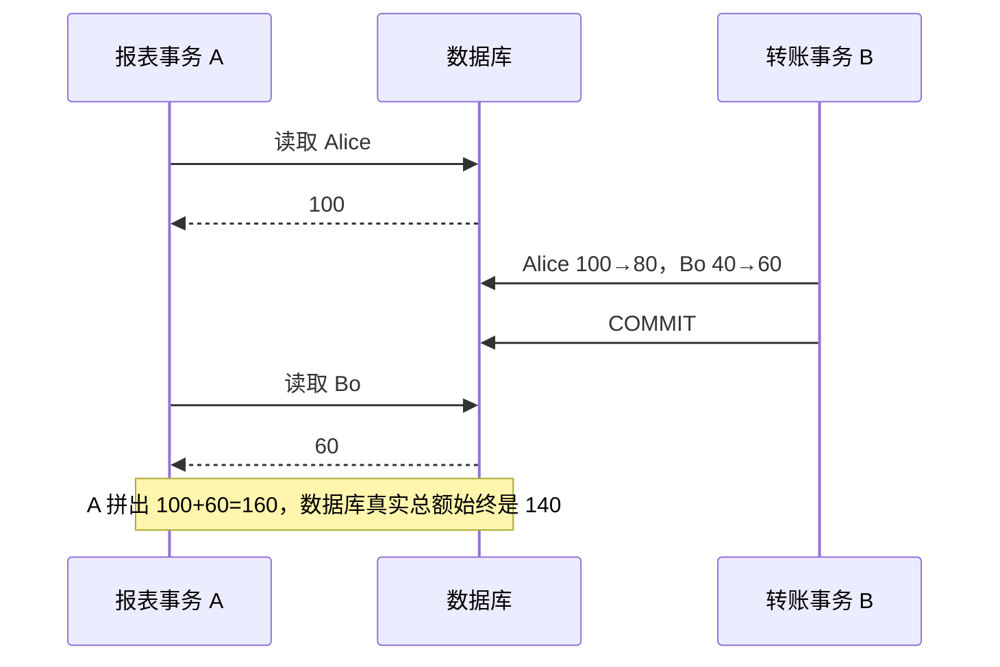
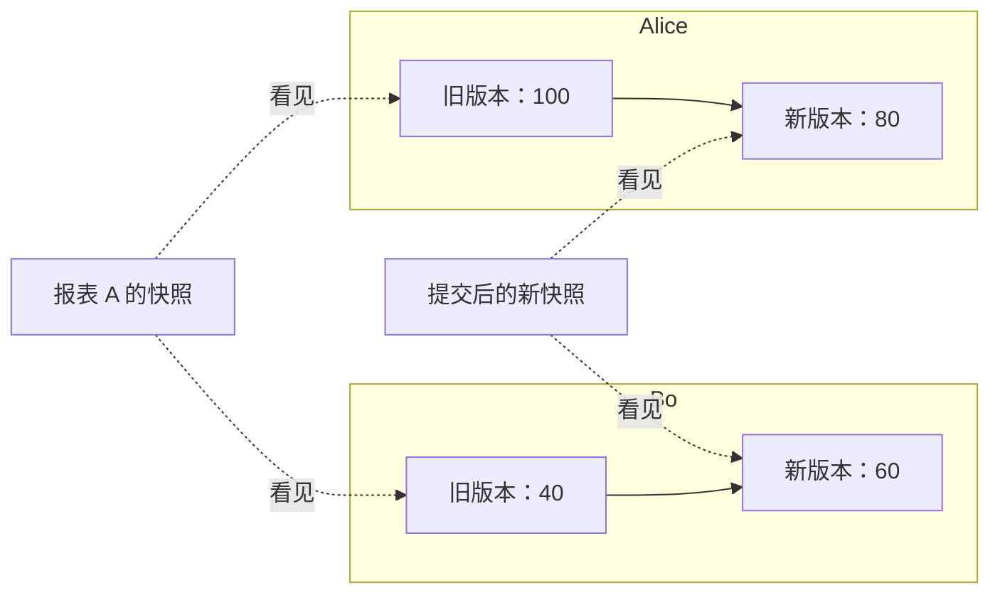
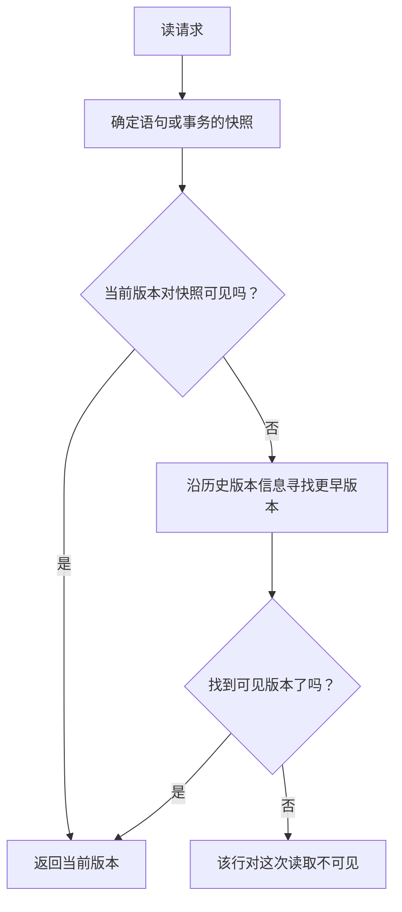
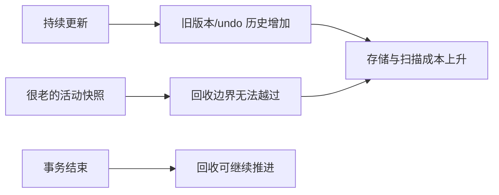

## 问题：报表读到一半，转账已经提交

继续看 Alice 和 Bo 的账户。开始时余额分别是 100 和 40，总额 140。报表事务 A 想多次检查这两个账户；转账事务 B 把 Alice 的 20 元转给 Bo。

报表如果先读 Alice=100，转账随后提交 `(80, 60)`，再读 Bo=60，就会拼出 `(100, 60)`，总额 160。这个组合从来没有真实存在过。



先停一下：如果让 A 从头到尾锁住它读过的行，结果会怎样？如果完全不协调，为什么两个各自合法的读取会拼出一张从未存在过的报表？

## 尝试：读的时候把写者挡住

上一课已经看到锁能排出冲突操作的先后。最直接的修补，是让报表读到 Alice 后一直锁住它，再读 Bo；转账 B 需要改 Alice，于是等待 A 结束。

```text
A: 锁 Alice → 读 100 ───────── 读 Bo=40 → 提交并解锁
B:                  等待……                  改两行并提交
```

这样 A 可以读到一致结果，但长报表会延迟在线转账。反过来，让 A 等所有写入结束，也会让报表等待写者。锁仍然是必要工具，尤其用于“我要改这行”或保护业务冲突；可只读查询若也要为每次读取互相阻塞，并非唯一选择。

## 发现：同一行可以保留不止一个可读状态

换个问题：B 把 Alice 从 100 改成 80 时，是否必须马上让所有读者只能看见 80？

如果数据库暂时保留旧值 100，A 可以继续用它完成报表；新事务则能看见已提交的新值 80。Bo 也同理：A 看见 40，新事务看见 60。A 得到 `(100, 40)`，B 之后的读者得到 `(80, 60)`，两边总额都是 140。



这给出一项新能力：**读者依据一个确定的快照判断版本是否可见，写者发布新版本时，不必让普通读取都等它。** 这种用多个版本协调并发读写的机制称为多版本并发控制（Multi-Version Concurrency Control，MVCC）。

“多版本”不是给每个事务拷贝整张数据库。它只要求系统保留足以让仍有效的读取重建所需旧状态的信息；具体版本放在哪里、谁能看见、何时回收，各引擎不同。

## 推导：快照不是简单的“事务开始时间”

先把事务看作带有可见性边界的观察者。某行可能经历以下状态：

```text
Alice: 100 ── B 更新并提交 ──> 80
```

读者 A 的快照若建立在 B 提交之前，就继续沿版本信息找到 100；若建立在 B 提交之后，就看到 80。若 B 尚未提交，其他事务通常不能把 B 的半成品当成已提交结果。

数据库需要回答的不只是“现在这行是什么”，还包括：

1. 这个版本由哪个事务创建或替换？
2. 对当前读者而言，相关事务是否已提交、是否在快照边界之前？
3. 若当前物理记录已更新，旧内容还能否从历史信息中重建？

可把概念流程画成：



这里的“快照”是一套可见性规则，不一定是一份完整物理副本；事务 ID、提交状态与版本链共同决定结果。

## 实验：同一事务重复读，什么时候会变化？

先预测下面的输出。A 使用 `READ COMMITTED`，两条查询之间 B 更新并提交：

```text
A: BEGIN
A: SELECT Alice.balance  → 100
B: Alice 从 100 更新为 80；COMMIT
A: SELECT Alice.balance  → ?
```

如果 A 使用每条语句新建的快照，第二次可能看到 80。若 A 使用整个事务共享的快照，第二次仍看到 100。MVCC 提供版本读取能力，但**隔离级别决定快照边界**；不能把“用了 MVCC”直接等同于“一个事务内永远读同一快照”。

| 快照策略（概念层面） | 第一次读取 | B 提交后，A 再读 | 典型用途/代价 |
|---|---:|---:|---|
| 每条语句一个已提交快照 | 100 | 80 | 语句读最新已提交状态，同一事务可观察变化 |
| 整个事务共享快照 | 100 | 100 | 多次读取基于同一观察边界；长事务会延长旧版本保留时间 |

这个小例子只讨论普通一致性读取；显式锁定读取、写入冲突和串行化检测另有规则。

## 实现对照：MySQL 与 PostgreSQL 怎样保留过去

**MySQL 8.0 InnoDB** 的聚簇索引记录带有事务标识与回滚指针。更新时相关旧值进入 undo 信息；一致性读根据 Read View 判断当前记录是否可见，若不可见，便沿 undo 信息重建较早版本。默认 `REPEATABLE READ` 下，同一事务的普通一致性读通常共享首次一致性读建立的快照；`READ COMMITTED` 则为每条一致性读建立新快照。[InnoDB 多版本](https://dev.mysql.com/doc/refman/8.0/en/innodb-multi-versioning.html) · [一致性非锁定读取](https://dev.mysql.com/doc/refman/8.0/en/innodb-consistent-read.html)

**PostgreSQL 18** 通常把更新后的新 tuple 写入 heap，旧 tuple 暂时留在表中。可见性信息帮助读者判断某个 tuple 对当前快照是否有效。普通读取和写入可以在很多场景下并行；但“读写不互相阻塞”不表示写写冲突、显式锁或所有 DDL 都没有等待。[PostgreSQL MVCC 简介](https://www.postgresql.org/docs/18/mvcc-intro.html)

| 问题 | MySQL 8.0 InnoDB | PostgreSQL 18 |
|---|---|---|
| 更新后旧内容在哪里？ | 通过 undo 信息重建较早版本 | 旧 tuple 暂留在 heap 中 |
| 普通读取如何选版本？ | 快照/Read View 决定；必要时沿 undo 重建 | tuple 可见性信息与快照共同决定 |
| 旧版本何时可清理？ | 不再有可能需要它的读视图后，由 purge 清理 | 不再可能被活动事务看见后，VACUUM 可回收死 tuple |
| 重要运维压力 | 长事务可阻止旧 undo 信息清理，历史积累会增加成本 | 长事务可延迟死 tuple 回收；VACUUM 还承担空间复用等职责 |

实现对照只为了让抽象落地：两者都提供 MVCC，却不是同一种物理存储方式。InnoDB 的 undo 同时服务回滚与旧版本读取；PostgreSQL 的 VACUUM 负责清理不再需要的旧 tuple，并维护其他元数据。[InnoDB 多版本与 purge](https://dev.mysql.com/doc/refman/8.0/en/innodb-multi-versioning.html) · [PostgreSQL 常规 VACUUM](https://www.postgresql.org/docs/18/routine-vacuuming.html)

## 新压力：读者一直不结束，历史就一直不能扔

旧版本不是免费备份。A 若长期保持一个很早的快照，数据库可能无法判断“过去”已经没人需要：A 仍可能读到旧余额 100。期间许多事务连续更新同一行：

```text
100 → 80 → 75 → 60 → 55 → ……
 ^
 A 的旧快照仍需要从历史中读到这里
```

为保证 A 能读到所需状态，系统必须保留必要的历史信息。事务结束、快照不再被任何读取需要之后，清理工作才有机会推进。这会表现为 InnoDB undo/purge 积压，或 PostgreSQL dead tuple/VACUUM 压力。长期事务、未结束的只读事务和复制槽等不同机制都可能影响回收边界，具体诊断要看对应引擎指标与文档。



所以 MVCC 不是“没有锁”或“读写完全免费”。它把许多读写冲突从互相等待，转化成了版本存储、可见性判断、写写协调与历史清理。

## 小练习：选出每个观察者应读的版本

Alice=100、Bo=40。A 建立快照后，B 在同一事务中将 Alice 改为 80、Bo 改为 60 并提交。接着，C 建立新快照。假设 A 的隔离策略保持同一快照：

1. A 再读两行，应得到哪一组余额？总和是多少？
2. C 读取两行，应得到哪一组余额？总和是多少？
3. 若数据库立刻删除 Alice=100、Bo=40，A 还可能正确完成读取吗？
4. 如果 A 改为每条语句新快照，哪些时点会让两次读取看到不同版本？
5. “MVCC 读不等写”为什么不能推出“长事务没有代价”？

<details>
<summary>逐步核对</summary>

1. A 的快照在 B 提交前，读取 `(100, 40)`，总额 140。
2. C 的快照在 B 提交后，读取 `(80, 60)`，总额仍是 140。
3. 不行。A 的快照仍需要旧版本；数据库必须保留能提供它的信息。
4. 若第一次查询在 B 提交前、第二次在提交后，A 可能先读 100 再读 60。此时它没有跨两条语句固定的同一快照。
5. 旧快照会延迟历史回收，系统仍需存储版本、判断可见性并处理写写冲突。

</details>

## 重建题

合上正文，从“报表读到一半，转账已经提交”开始解释：

1. 不协调的普通读取如何拼出从未存在过的 `(100, 60)`？
2. 保留旧版本如何让读者不必等写者完成普通读取？
3. 快照怎样决定哪个版本可见？
4. `READ COMMITTED` 的语句快照与事务级快照有何区别？
5. 长事务为什么会拖慢旧版本回收？
6. InnoDB undo 重建与 PostgreSQL heap 旧 tuple 有什么实现差别？

## 下一道压力：读懂 MVCC 还不够

现在能解释版本读取了，但还不知道一次 `UPDATE` 如何从 SQL 走到页、索引和日志，也不清楚 MySQL 与 PostgreSQL 在读视图、锁、WAL 和清理上的差别如何互相影响。

下一阶段将并排追踪同一个事务在 InnoDB 与 PostgreSQL 中的路径，再问：当单机容量或可用性不足时，怎样把已经理解的版本与事务语义带到多个副本？

## 自检

- [ ] 能用一组具体版本解释快照怎样防止报表读到拼接状态。
- [ ] 能区分 MVCC 的版本机制与隔离级别的快照边界。
- [ ] 能说出 InnoDB undo 与 PostgreSQL 旧 tuple 的基本差异。
- [ ] 能解释为什么旧快照会延迟 purge/VACUUM 的回收工作。
- [ ] 能从 MVCC 获得的并发能力推导版本存储和清理的新成本。
