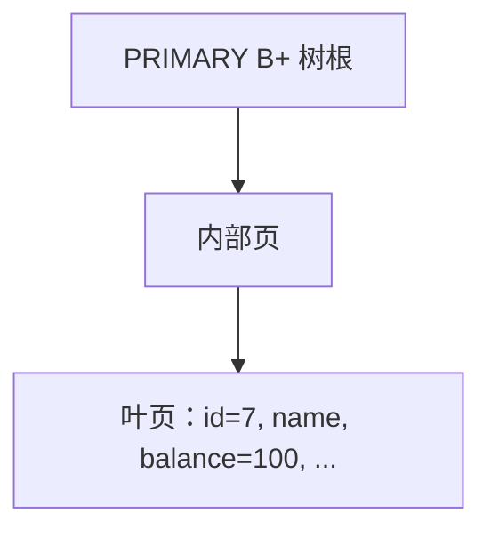
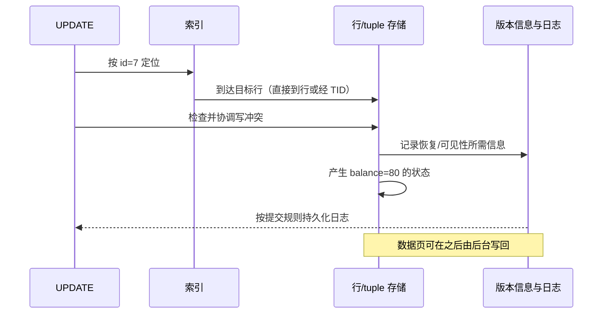

## 问题：SQL 一样，数据到底放在哪里？

我们一直用 `accounts(id, name, balance)` 讨论数据库。现在固定一条操作：把 `id=7` 的余额从 100 改成 80，并且保证事务提交后可恢复、其他事务能读到符合快照规则的版本。

```sql
UPDATE accounts
SET balance = 80
WHERE id = 7;
```

SQL 只说“改哪一行、改成什么”，没有告诉我们：索引叶子里放的是整行还是行地址？旧版本放哪里？提交时刷哪种日志？一次更新需要碰几棵树？

先预测：如果索引找到 `id=7`，是不是两个数据库都会从索引叶子直接读到完整行？如果 `balance` 不在任何索引里，更新它还需要改索引吗？

## 先建立共同的抽象：从键找到行，再保护修改

对一条按主键定位的更新，两个引擎都要完成几件逻辑工作：

```text
解析 SQL 与选择访问路径
  → 通过索引定位目标记录
  → 判断事务能否更新它，并协调冲突
  → 产生新状态，同时保留恢复/可见性所需信息
  → 让提交满足持久性规则
```

这是一条逻辑路径，不是说每个步骤都对应一次磁盘 I/O。页可能已经在内存，也可能要从盘读；缓存命中、索引层数、行格式、并发冲突都会改变实际成本。


## 发现：第一个分叉发生在“索引叶子是什么”

### InnoDB：主键树的叶子就是整行

InnoDB 用主键组织聚簇索引；聚簇索引叶子包含行数据。若通过主键 `id=7` 查找，沿这棵 B+ 树找到叶子时，通常就到达了该行的记录内容。



若没有显式主键，InnoDB 会选择合适的非空唯一索引作为聚簇键；若仍没有，则生成隐藏的聚簇标识。二级索引叶子保存索引列和主键列；需要整行时，可拿主键回到聚簇索引查找。因此主键大小会影响二级索引占用空间和访问路径。[InnoDB 聚簇与二级索引](https://dev.mysql.com/doc/refman/8.0/en/innodb-index-types.html)

### PostgreSQL：索引项指向 heap 中的 tuple

PostgreSQL 的普通表数据保存在 heap 中；B-tree 索引在物理上与表分开。索引把键映射到 heap tuple 的 TID（块号与页内项目号），执行器再据此访问 heap，并按快照检查 tuple 可见性。

```mermaid
flowchart LR
    I[主键 B-tree：id=7] -->|TID=(页 42, 项 3)| H[heap 页 42：tuple id=7, balance=100]
```

因此“索引命中”不总意味着“行内容已到手”；可能还要读 heap 页面。PostgreSQL 也能做 index-only scan，但是否省去 heap 检查取决于查询需要的列和可见性信息，不能把它当成所有索引读取的常态。[PostgreSQL 索引访问方法](https://www.postgresql.org/docs/18/indexam.html) · [数据库页布局](https://www.postgresql.org/docs/18/storage-page-layout.html)

| 结构问题 | InnoDB | PostgreSQL |
|---|---|---|
| 主键索引叶子 | 聚簇行数据 | 通常保存指向 heap tuple 的 TID |
| 二级索引定位 | 保存二级键与主键；回聚簇索引可找整行 | 索引项指向 heap tuple |
| 更新非索引列 | 修改聚簇记录及事务/日志信息；通常不改不受影响的二级树 | 创建新 heap tuple 版本；若满足 HOT 条件，可免建新的普通索引项 |
| 一种直接后果 | 主键的长度会传播到二级索引 | heap 与索引分离，读取可能需要额外 heap 访问 |

## 沿同一条 UPDATE 再走一遍

假设表有 `PRIMARY KEY(id)`，另有 `INDEX(name)`，而 `balance` 没有索引。

### 第一步：找到 id=7

两者都能使用主键索引定位，但落点不同：InnoDB 到聚簇索引叶子上的行；PostgreSQL 到索引给出的 heap TID，再读取 tuple。若需要 `balance` 的旧值，PostgreSQL 需要相应 heap 内容；InnoDB 聚簇叶子已包含整行。

### 第二步：确认写入权与版本状态

更新不是简单覆盖内存中的数字。事务要遵守行级冲突规则；若另一个事务正改同一行，更新者可能等待或在特定隔离情况下需要重试。需要旧状态的读者仍可能通过 MVCC 看到先前版本。

### 第三步：产生新状态，并考虑索引代价

InnoDB 更新聚簇记录；undo 信息支持回滚及一致性读，redo 支持崩溃恢复。`name` 未变，所以这个例子不需要因为 `balance` 更新而改变 `name` 二级索引的键值。

PostgreSQL 更新时产生新的 heap tuple 版本，旧 tuple 不会立刻从表中消失。若更新列没有被索引引用、且同一 heap 页有空间，可能使用 HOT（Heap-Only Tuple）优化，避免新增普通索引项；否则一般要为新版本更新相关索引项，之后再由 VACUUM 回收死亡版本和索引垃圾。[PostgreSQL HOT](https://www.postgresql.org/docs/18/storage-hot.html) · [PostgreSQL VACUUM](https://www.postgresql.org/docs/18/routine-vacuuming.html)

### 第四步：用各自的日志保证恢复

InnoDB 将需要的修改写入 redo，并用 undo 信息支持回滚和历史版本读取。PostgreSQL 通过 WAL 记录恢复所需的信息。两者都遵守各自的日志与刷盘规则；事务向客户端确认提交，不等于这次修改的所有数据页都已同步改写到最终文件位置。



## 两种实现为何走出不同取舍？

InnoDB 把主键与行数据合并在聚簇 B+ 树里。按主键查整行很直接，范围扫描可沿有序叶子前进；代价是主键列会出现在二级索引中，主键设计影响整个索引集合。

PostgreSQL 把 heap 与索引分开，并用 MVCC tuple 版本支撑快照读取。索引能定位到某个 tuple，但旧版本和新版本在 heap 中各有生命期；更新可能产生更多 tuple 与索引维护工作。HOT 在限定条件下削减这部分成本，VACUUM 处理可回收空间。

这不是“哪种结构更先进”的结论，而是读写路径、索引维护、缓存占用与清理方式之间的选择。工作负载的主键大小、更新列、索引数、长事务和查询访问列，都会改变哪条路径更省。

## 小实验：预测索引变化

考虑如下表：

```sql
CREATE TABLE accounts (
    id BIGINT PRIMARY KEY,
    name TEXT NOT NULL,
    balance BIGINT NOT NULL
);

CREATE INDEX accounts_name_idx ON accounts(name);
```

逐条判断，写下你预计被访问或维护的结构。先不要查答案：

1. `SELECT balance FROM accounts WHERE id = 7;`
2. `SELECT id FROM accounts WHERE name = 'Alice';`
3. `UPDATE accounts SET balance = balance - 10 WHERE id = 7;`
4. `UPDATE accounts SET name = 'A.' WHERE id = 7;`

<details>
<summary>逐步核对</summary>

1. 两者按主键定位。InnoDB 从聚簇索引叶子取整行；PostgreSQL 通常由主键索引找到 heap tuple。若 PostgreSQL 的可见性信息允许 index-only scan，特定计划可能减少 heap 访问，但不能仅凭 SQL 投影列就保证这一点。
2. InnoDB 走 name 二级索引，若需 `id` 可由二级项中的主键值满足；PostgreSQL 通过 name 索引得到 TID，通常还要检查 heap tuple 可见性，具体能否 index-only 取决于计划和 visibility map。
3. `balance` 未索引。InnoDB 修改聚簇记录并维护事务/日志状态，不因 balance 值本身变化而改 name 索引。PostgreSQL 产生新 tuple；页有空间且条件合适时可 HOT，否则还需索引维护。
4. 两者都要处理 name 索引，因为索引键值变了。PostgreSQL 不能对该行使用“不改索引列”的 HOT 前提；InnoDB 需要维护受影响的二级索引项。

</details>

## 重建题

从相同的 `UPDATE accounts SET balance=80 WHERE id=7` 开始，合上正文说明：

1. 两个引擎怎样从 id 找到行？
2. InnoDB 的聚簇叶子与 PostgreSQL 的索引 TID 各自意味着什么？
3. `balance` 未被索引时，为什么 PostgreSQL 仍然要产生新 tuple？
4. HOT 在哪些条件下能少做索引工作？
5. 旧版本、日志和数据页写回各自回答什么问题？
6. 哪些业务特征会影响两种物理组织的成本？

## 下一道压力：一台机器之外

我们现在能追踪单机引擎如何定位、改写、保留版本并恢复一行数据。但单机可靠并不能抵抗整台主机或磁盘故障；增加副本后，新的问题出现了：一个副本确认了写入，其他副本何时也必须看到？

下一阶段从“复制只是异步抄数据，够不够？”开始，推导复制确认语义、故障模型，再走向日志复制与分布式共识。

## 自检

- [ ] 能画出 InnoDB 从主键到聚簇行的路径，以及 PostgreSQL 从索引 TID 到 heap tuple 的路径。
- [ ] 能解释 InnoDB 二级索引携带主键对空间和访问的影响。
- [ ] 能说明 PostgreSQL 更新为什么有 tuple 版本，以及 HOT 何时可能减少索引项。
- [ ] 能把 undo/WAL 与旧版本/数据页写回区分开。
- [ ] 能从一条 UPDATE 推导副本复制出现的新问题。
