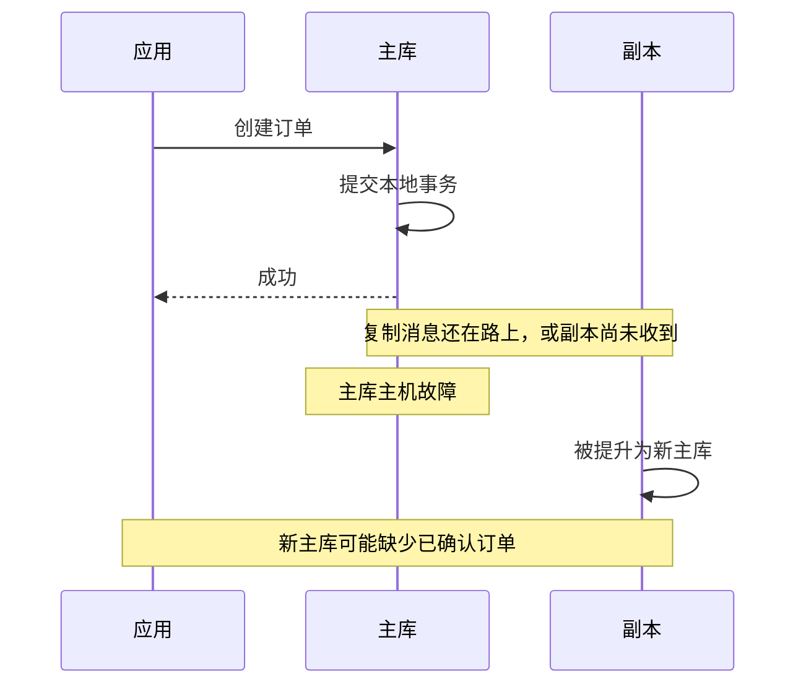
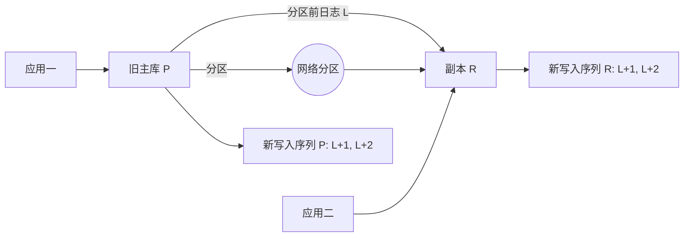

## 问题：收到“成功”后，主机就宕机了

某电商订单事务已经在主库提交，应用也收到了成功响应。此时主机突然断电。运维把一个副本提升为新主库，客户却发现订单不见了。

先预测：既然主库返回提交成功，为什么副本可能没有订单？“有两台数据库”是否自动等于“已确认的数据有两份”？



## 尝试：让副本不断抄主库的数据

上一课看到每个单机引擎都会产生日志。于是一个自然方案是：主库把变化写进日志，副本持续接收并重放。副本可以提供只读查询，也能在主库故障时成为候选接替者。

```text
主库：事务写入 → 产生复制日志 → 客户收到提交答复
                                  ↓ 网络传输（异步）
副本：                   接收日志 → 重放 → 查询可见
```

复制至少需要三个阶段：

1. **建立共同起点**：给副本一份与某个日志位置对应的数据快照。
2. **传递后续变化**：把快照之后的变更日志传过去。
3. **按正确顺序应用**：副本恢复/执行日志，使自己的状态推进。

只有日志流，没有共同起点，副本不知道从哪份数据开始；只有快照，没有后续日志，它很快又会过期。

## 发现：异步复制缩短提交等待，却留下丢失窗口

异步模式下，主库不等副本确认就可以答复客户端。主库可以低延迟提交，副本也能稍后追赶；网络断开时，主库仍可继续工作一段时间。代价是，主库在某条已答复的日志到达副本之前永久损坏，接管副本就可能缺少那条事务。


副本追赶延迟（replication lag）是一个可观察的状态，不只是仪表盘上的数字：它会影响副本读能否读到刚写的数据、故障切换可能丢多少数据、以及副本断连后还能否从保留日志恢复。

若应用写入主库后立即从落后副本读取，可能出现“刚写成功，马上查询却查不到”。常见的业务处理包括写后读继续路由到主库，或等待副本确认达到该事务对应的日志位置；后一种做法需要明确定义等待条件和超时结果。

## 推导：提交答复应该等哪个事件？

把一次事务写入抽象为日志位置 `L`。主库可以在不同阶段发确认：

```text
生成 L
  → 主库本地日志持久化
  → 副本收到 L
  → 副本把 L 写入自己的日志/磁盘
  → 副本重放 L，使查询能看到事务
```

这几步不是一回事。若只等“副本收到网络数据”，副本断电时可能仍丢失；若等“副本日志已持久化”，副本恢复后可继续重放，但尚未应用到查询状态；若等“副本已重放”，等待更久，却能把“确认后能否在副本查询到”作为更强条件。

同步复制规定提交答复需要等待哪些副本事件，但“同步”一词本身不够精确。至少还要说清：

- 要等几个副本？任意几个，还是指定优先级的几个？
- 确认代表收到、写入操作系统、刷到持久存储，还是已经重放？
- 失去足够副本时，是阻塞写入，还是切回较弱模式？
- 副本确认过的日志，提升和选主时如何保证不会被新主覆盖？

## 概念：同步确认用延迟换更强的持久性

如果提交要等远端确认，至少增加一次网络往返延迟。网络变慢或同步副本不可用时，写入可能变慢甚至无法按配置完成。这并非性能实现的偶然问题，而是“需要远端参与成功条件”的直接成本。

下面以 PostgreSQL 18 的物理流复制为例，列出几个确认边界。真实配置还要结合 `synchronous_standby_names`、`synchronous_commit` 及拓扑判断：

| 等待边界 | 大致确认含义 | 能回答什么 |
|---|---|---|
| 本地提交 | 主库按本地设置确认 | 本机提交完成；异步副本仍可能落后 |
| `remote_write` | 同步副本已收到并写入操作系统，但未保证副本断电仍在盘 | 比只发出网络包更强，持久性弱于远端刷盘 |
| `on`（默认） | 同步副本确认提交 WAL 已写入持久存储 | 提高主机故障后的数据保留保证；提交需等待远端 |
| `remote_apply` | 同步副本已经重放提交记录 | 可等待副本查询能看见事务，通常还要多等应用过程 |

PostgreSQL 文档明确把接收、持久写入和重放区分开；通过 `synchronous_standby_names` 可指定基于优先级或 quorum 的等待方式。同步配置增强的是特定提交路径的远端确认，不会替你自动解决所有选主和双主问题。[PostgreSQL 18 同步复制](https://www.postgresql.org/docs/18/warm-standby.html) · [复制配置参数](https://www.postgresql.org/docs/18/runtime-config-replication.html)

MySQL 8.0 默认是异步复制。其半同步插件可让主库等待至少一定数量副本将事务事件接收并写入 relay log 后，再向客户端返回；这不要求副本已经执行并提交事务。若等待超时，主库会退回异步模式，所以监控与故障策略必须知道当前实际工作模式。[MySQL 8.0 半同步复制](https://dev.mysql.com/doc/refman/8.0/en/replication-semisync.html)

## 新压力：副本确认过，不等于故障切换一定安全

设主库 P 和副本 R。R 已确认日志位置 L；网络随后分区，P、R 都无法判断对方是宕机还是暂时不可达。如果应用仍把写请求送给 P，同时运维又把 R 提升为主库，两个节点可能各自在同一段时间接受写入：



两个分支可能都合法地向各自客户端答复成功，却形成无法直接合并的历史。要避免双主，不能只“猜哪台机器坏了”；需要故障检测与**隔离旧主**（fencing），确保它不会继续服务写请求，再按规则选出可安全接管的副本。

还有一个容易忽略的窗口：客户端发出 `COMMIT` 后连接断开。主库可能已经提交，只是成功响应没有抵达客户端；也可能根本没提交。客户端单看超时无法知道是哪一种。应用需要用事务状态查询、幂等键或安全重试设计处理“结果不确定”，不能把网络超时直接解释为回滚。

## 复制与共识：它们解决相连但不同的问题

复制回答：“怎样把某个副本的变化带到其他副本？”

共识回答：“多个可能故障的节点，怎样对某个日志前缀的提交顺序作出安全的一致决定？”

单主异步复制通常能传递日志，却不保证主库确认过的每条记录已经在故障接管集合里；同步确认改善这个窗口，但还需要确保选出的新主包含必须保留的提交，并隔离旧主。若多个节点都可能争取主导权，就需要一套任期、投票、日志匹配和提交规则来约束它们。

共识不是“把数据库复制一遍”的同义词，也不自动提供 SQL 事务、跨分片原子性或全局时间。下一课会从两台机器可能各自宣布自己是主库的失败出发，推导 Raft 为何需要多数派、任期和日志匹配。

## 小练习：这次确认究竟承诺了什么？

有主库 P 和两个副本 R1、R2。订单事务 T 在 P 已提交，R1 已把日志写入持久存储但尚未重放，R2 尚未收到。随后 P 故障。

1. 如果系统是异步复制，能否仅凭 T 在 P 提交，就断言 R1 或 R2 一定有 T？
2. 如果客户端只收到“R1 已持久写入”的确认，能否立即断言 R1 的查询已经看见 T？
3. 如果同步规则要求任意一个副本 durable ack，哪一种接管候选至少满足数据条件？为什么仍不能忽略旧主隔离？
4. 如果客户端在提交响应到达前超时，为什么重试一个“创建订单”请求可能重复创建？
5. 网络分区时，什么机制可以防止 P 和 R1 同时接收新写入？

<details>
<summary>逐步核对</summary>

1. 不能。异步主库不等待副本确认，T 可能还没有到达任何副本。
2. 不能。持久写入与重放可见是不同阶段；R1 恢复后可以重放，但当下的只读查询可能还看不到 T。
3. R1 有已确认的持久日志，满足题设的副本数据条件；R2 不满足。仍须阻止旧 P 继续服务写入，否则两条写入历史会分叉。
4. 首次请求可能已提交，只是答复丢失；再次创建会执行第二次。幂等键可让两次请求表示同一个业务动作。
5. 需要可靠的主从切换规则和 fencing。下一课讨论共识怎样给日志与领导者资格提供安全约束。

</details>

## 重建题

合上正文，重建这条因果链：

1. 为什么副本需要共同快照和后续日志？
2. 异步复制如何产生已确认事务丢失窗口？
3. “收到”“持久写入”“重放可见”分别意味着什么？
4. 同步等待怎样增加延迟，副本不可用时会带来什么选择？
5. 为什么确认语义还不能自动解决安全选主和双主？
6. 共识要补上的核心规则是什么？

## 自检

- [ ] 能从主库提交后立即故障的时间线解释数据丢失。
- [ ] 能区分复制日志传递、远端持久化和副本重放。
- [ ] 能比较 PostgreSQL 同步等待边界与 MySQL 半同步确认边界。
- [ ] 能解释副本延迟如何影响读后写和故障切换。
- [ ] 能区分复制、故障切换与共识分别要解决的问题。
