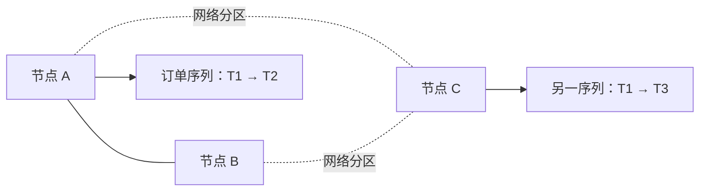
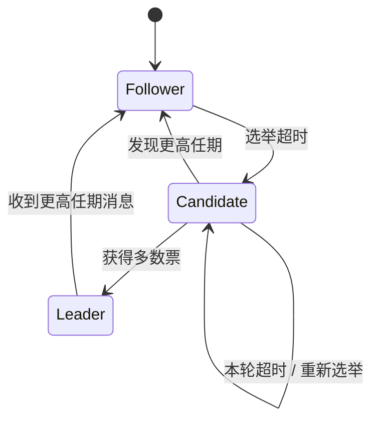
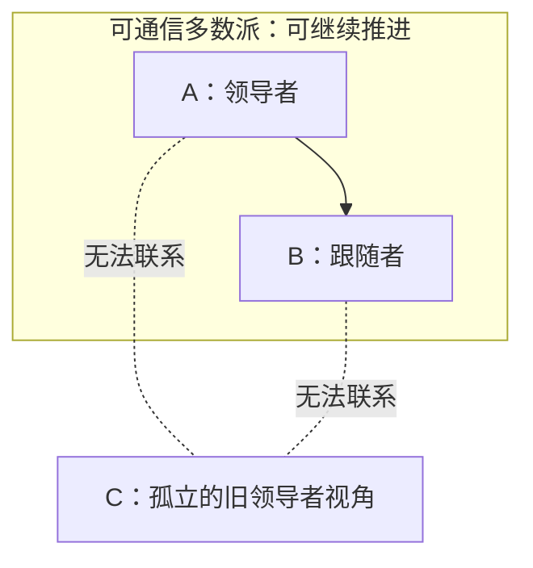
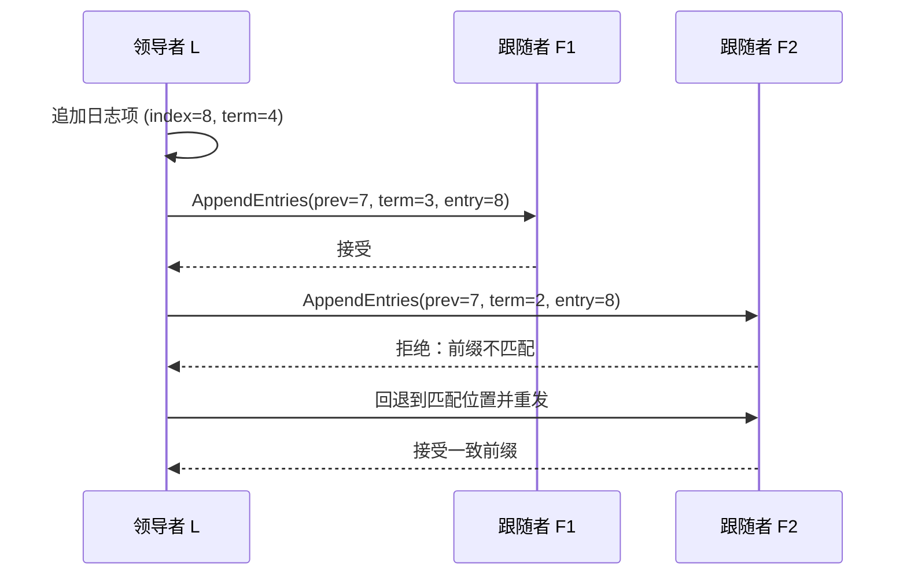

## 问题：网络分区后，两边都觉得自己是主

三台数据库节点 A、B、C 共同保存一份订单日志。网络发生分区：A 与 B 还能通信，C 与它们断开。若 A 和 C 都接受写入并各自回复成功，恢复网络后，两边的订单顺序可能不同。

先预测：怎样判定谁可以继续提交新日志？如果依赖“我发消息很久没收到回复，所以对方肯定死了”，在网络只是慢而不是断时会发生什么？



超时只能说明“消息没有及时回来”，不能证明“对方已经停止运行”。网络中的节点无法直接观察另一台机器是否宕机，这正是单主复制在故障切换时留下的难题。

## 尝试：让节点投票选一个领导者

我们需要给日志顺序一个共同来源。让节点通过投票选出领导者，由领导者接收客户端命令并把日志项复制给其他节点。领导者收集到足够支持后，才把日志项标记为已提交；各节点再按同一顺序应用已提交项。

```text
客户端命令 → 当前领导者追加日志 → 复制到其他节点
                              → 收到多数派确认 → 提交并应用
```

**停一下**：如果领导者坏了，谁来判断这一项是否已提交？如果一个落后的节点先被选中，它会不会覆盖其他节点已经提交的记录？“投票选主”还缺少什么安全条件？

## 发现：用任期把领导权分成一轮一轮

Raft 将时间划分为**任期**（term），任期号单调递增，可当作领导权更迭的逻辑时钟。每个节点处于以下角色之一：

- **跟随者**（follower）：响应领导者或候选者的 RPC。
- **候选者**（candidate）：发起选举并请求投票。
- **领导者**（leader）：接收日志请求并复制日志。

跟随者在随机选举超时时间内没收到有效领导者消息，就增加任期、给自己投票并请求其他节点投票。节点在同一任期最多投一票；候选者拿到配置成员中的多数票后当选。随机超时降低多个候选者同时发起选举、选票分散的概率。



多数派有一个简单而关键的性质：两个多数派必定相交。五个节点时，任意多数派至少有三个节点；两个三节点集合至少共享一个成员。

```text
多数派 Q1 = {A, B, C}
多数派 Q2 =       {C, D, E}
共同节点       = {C}
```

如果节点只在同一任期投一次票，两个互不相同的候选者就不可能各拿到相交多数派的票。因此同一任期最多有一个赢得多数票的领导者。不同任期仍可能先后各有领导者；旧领导者一旦发现更高任期，就必须退回跟随者。

不过，票数还不够：投票者还要比较候选者日志是否至少和自己一样新。比较时先看最后一条日志的任期，任期相同再看索引；候选者落后时，投票者拒绝投票。节点还必须把任期、已投给谁和日志等关键状态持久保存，避免重启后忘记已经投过票。这样，多数派相交才能进一步保护已经提交的日志不被一个过时候选者带进新任期。

## 新能力：少数派可以活着，但不能独自提交

在三节点组 `{A, B, C}` 中，多数派是 2。A、B 在一起时可以选主并提交；C 被隔离后无法得到多数派。若旧领导者恰好在 C，它可能还没意识到自己已失去多数派，但不能凭一台机器的本地日志把新记录安全提交。



这里的目标不是“让每个节点在任何分区下都能写”。目标是保住已提交日志的一致顺序；失去多数派的一侧牺牲写入可用性，避免制造另一个可提交历史。多数派还能容忍的崩溃节点数为 `floor((N-1)/2)`：3 节点可容忍 1 个，5 节点可容忍 2 个；实际故障域和网络布局同样重要。

## 推导：追加日志时先核对共同前缀

领导者收到命令后，先把它追加到本地日志，再用 `AppendEntries` 请求把日志项发给跟随者。请求包含前一条日志的索引和任期。跟随者只有在对应前缀匹配时才接受后续项；若不匹配，拒绝请求，领导者回退尝试较早前缀，直到双方找到匹配位置，再修复冲突的未提交后缀。



日志匹配规则给出递推保证：若两个日志在同一索引拥有相同任期的项，那么该位置之前的日志也完全一致。多数派相交确保已经确认的安全前缀能影响之后的选举；领导者完整性规则要求未来的领导者包含先前已提交的日志项。

## 关键细节：不是任何“多数派里有”都能立刻提交

有一个容易误用的简化规则：“某日志项复制到多数派，就提交。”Raft 不能对所有旧任期项都这样数票。

想象任期 2 的领导者把旧项 `x` 复制到多数派，但尚未安全提交就崩溃。任期 3 的新领导者可能带着另一条日志被选出。若新领导者后来看到旧项 `x` 仍在若干节点上，就只凭“现在多数派里也有 x”宣布提交，某些选举和覆盖历史可能让安全推理失败。

Raft 的直接多数派提交规则只对**当前任期**产生的日志项计数。当前任期的一项复制到多数派并提交后，依据日志匹配性质，它之前的日志项（包括旧任期项）也随之安全提交。实现通常会用新领导者当前任期的一项，常见做法是追加空操作项，推进并确认前缀；算法实现的细节以协议说明为准。[Raft 论文：日志复制与安全性](https://raft.github.io/raft.pdf)

## 观察：共识的安全与活性依赖不同条件

随机选举超时不是为了证明哪台机器真的坏了，而是帮助幸存节点最终集中到一个候选者。网络恢复、消息延迟最终足够小且多数派可通信时，选举才有机会稳定下来；如果节点持续互相超时或多数派不可达，系统可以保持安全，却可能暂时无法提交。

因此要把两个目标分开：

| 目标 | 要求 | 失效表现 |
|---|---|---|
| 安全性（safety） | 不同节点不能把不同命令当作同一日志位置的已提交结果；已提交日志不能被未来领导者丢弃 | 违背会破坏数据正确性 |
| 活性（liveness） | 条件允许时，系统最终能选出领导者并提交新日志 | 失去多数派或网络长期不稳定时，写入停滞 |

超时长短会影响切换速度和误触发频率，但不能替代多数派规则；安全性不应建立在“网络消息总在某个固定毫秒内到达”的假设上。Raft 处理的是崩溃/失联故障模型，不是任意节点恶意撒谎或篡改数据的拜占庭故障。

## 复制状态机：日志相同，状态才会一致

到目前为止，我们决定的是一串命令的提交顺序。要让数据库状态相同，各节点还需要把已提交日志按顺序应用到确定性的状态机：

```text
日志项 1 → apply → 状态 S1
日志项 2 → apply → 状态 S2
日志项 3 → apply → 状态 S3
```

若节点把同一日志按不同次序应用，结果仍可能不同。协议因此要求已提交条目以日志顺序应用，并维护状态机安全性质：任何节点一旦在某索引应用了一个命令，其他节点不能在同一索引应用不同命令。

数据库产品会把 Raft 用在某个复制组的日志/状态上；数据库 SQL 事务还可能跨多个组，并涉及时间戳、锁或两阶段提交。Raft 多数派确认某个复制组日志项，不等于一笔跨组 SQL 事务已经原子提交。

## 小练习：谁能提交，谁能当选？

一个五节点 Raft 组 `A–E` 的多数派需要几票？

1. 当前领导者 A 与 B、C 复制了任期 4 的索引 8；D、E 尚未收到。索引 8 能否按当前任期规则提交？
2. 若 A 与 B 被隔离，C、D、E 能否继续选出领导者并提交？
3. 若两个分区分别只有 A、B 和 C、D，哪一边能形成多数派？
4. 若任期 4 的旧项只存在于少数节点，能不能仅凭“这个旧项现在也在新领导者一侧的多数派里”就宣布它已提交？
5. 少数派中的旧领导者为什么可能仍认为自己是 leader，但不能安全确认写入？

<details>
<summary>逐步核对</summary>

1. 能。A、B、C 共 3/5，且该项属于当前任期 4，达到多数派复制。
2. 能。C、D、E 正好有三票，可以选举并继续复制日志；A、B 不能独自提交新条目。
3. 都不能。五节点要三票，2/3 的两个集合都不足。
4. 不能简单这样判断。Raft 的多数派计数规则直接提交当前任期项；旧任期项在当前任期项安全提交后，才随共同前缀一起提交。
5. 它无法区分“节点已崩溃”和“网络断开”。但它联系不到多数派，无法获得足够复制确认；新任期消息到达后，它还必须退为 follower。

</details>

## 重建题

从网络分区的三节点组开始，不看正文说明：

1. 为什么超时不能证明对端宕机？
2. 任期、每任期一票和多数派如何阻止同一任期出现两个获选领导者？
3. 为什么任意两个多数派必相交？
4. `AppendEntries` 的前缀检查怎样把副本日志重新对齐？
5. 为什么旧任期项不能单独套用“复制到多数派就提交”的规则？
6. 什么情况下 Raft 可以安全但暂时不可用？
7. Raft 已提交日志与数据库跨分片事务提交之间还差什么？

## 下一道压力：一个日志组还不够

单个 Raft 组能为自己的日志顺序提供安全规则，但数据量扩大后通常会把键分散到多个组。一次 SQL 事务可能同时修改两个组：即使每个组都各自正确复制，怎样保证它们要么一起提交、要么一起失败？

下一阶段将从“两个共识组各自提交，整体事务却只成功一半”的反例，推导分片路由、事务协调与两阶段提交。

## 自检

- [ ] 能用三节点和五节点算出多数派，并解释多数派相交。
- [ ] 能区分任期、选举超时和领导者资格。
- [ ] 能用共同前缀解释 AppendEntries 如何修复日志。
- [ ] 能说出当前任期提交规则及其对旧任期项的影响。
- [ ] 能区分安全性与活性，也能说出 Raft 的故障模型边界。
- [ ] 能说明 Raft 日志提交并不等同于跨分片 SQL 事务提交。
