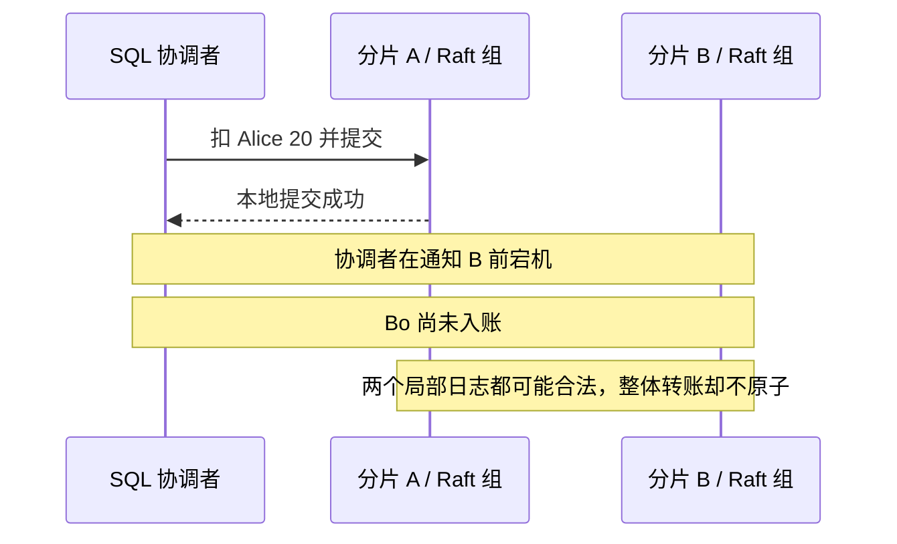
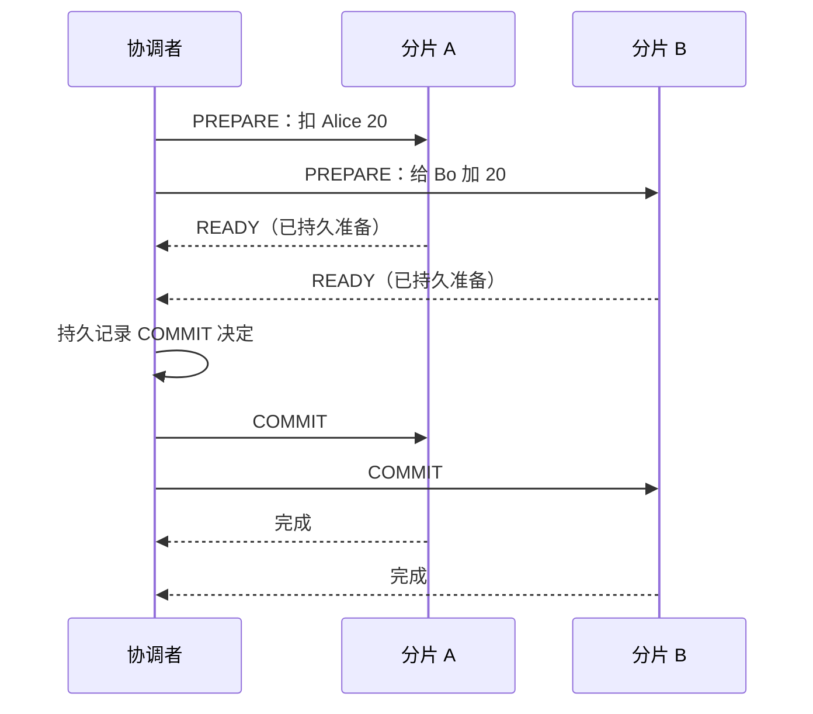
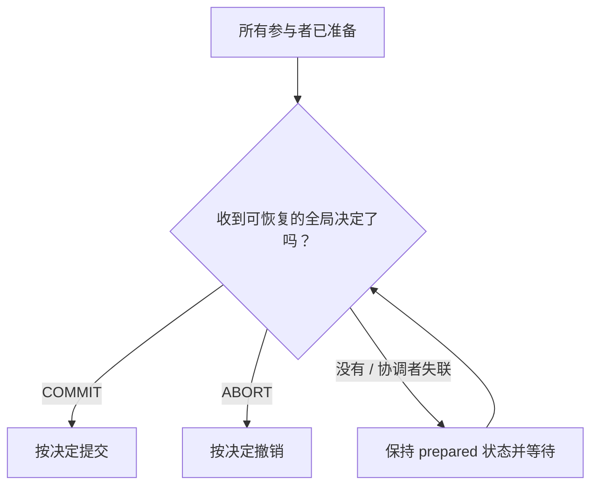
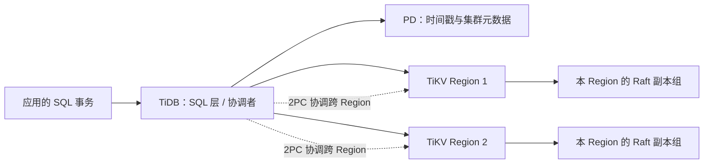

## 问题：两个共识组分别提交，钱却只转出去

Alice 的账户在分片 A，Bo 的账户在分片 B。转账 20 元需要同时执行：

```sql
BEGIN;
UPDATE accounts SET balance = balance - 20 WHERE name = 'Alice';
UPDATE accounts SET balance = balance + 20 WHERE name = 'Bo';
COMMIT;
```

假设 A 和 B 各自有 Raft 组，组内写日志都安全。若 A 已提交扣款，协调者随后宕机，B 还没提交入账，数据库就留下 `(80, 40)`：每组都遵守自己的日志顺序，整个转账仍然只做了一半。



先想想：可不可以先提交 A，再提交 B，最后如果 B 失败就把 A 加回 20？如果补偿操作执行前，协调者又崩溃呢？

## 尝试：把本地事务一个接一个运行

单机事务可以让多次更新一起提交或一起回滚；Raft 组也能决定本组日志的安全顺序。但两个不同组各自提交，本身没有一个共同决定告诉它们“这笔业务整体提交还是整体撤销”。

关键缺口不是多复制几份日志，而是要增加**事务协调者**：它收集所有参与者的准备结果，并让所有参与者遵循同一个最终决定。

## 推导：先准备，再发布同一个决定

两阶段提交（Two-Phase Commit，2PC）把全局提交拆为两个阶段。以下先看抽象协议：

### 第一阶段：准备（prepare）

协调者让 A、B 准备转账。每个参与者检查本地冲突、约束与资源条件，并把足以恢复的“我已准备好”状态持久化；准备成功后，它承诺：在获知最终决定之前，不会自行把这部分修改当作普通已提交数据，也不会擅自释放所需锁/意向。

### 第二阶段：决定（commit 或 abort）

- 如果所有参与者都答复准备成功，协调者记录全局 `COMMIT` 决定，再通知各参与者提交。
- 只要有参与者拒绝或准备超时，协调者可以记录 `ABORT`，并通知参与者撤销准备状态。



真正的顺序不能只记成“协调者发了 commit”：若协调者尚未持久记录决定就崩溃，恢复后不知道应提交还是撤销。全局决定必须在通知参与者前留下可恢复的记录，或由协议中等价的持久状态表达。

## 新压力：参与者已准备好，却联系不上协调者

A 和 B 都准备成功并保留了锁。此时协调者在记录最终决定之前宕机；参与者只看到“协调者消失”，不知道它究竟已经决定提交、决定撤销，还是还没来得及决定。

如果参与者自行提交，可能和协调者后来恢复后记录的 `ABORT` 冲突；如果自行撤销，也可能违背已持久记录的 `COMMIT`。在经典 2PC 中，参与者在无法判定全局决定时必须等待恢复信息，期间锁和资源可能一直被占用。这称为**阻塞性**。



所以 2PC 给出的不是“网络分区时每边都可以继续完成事务”。当节点无法通信时，它可能暂停事务来守住原子性。参与者需要超时检测、协调者日志恢复、事务状态查询和运维处理；单靠超时不能安全猜测最终决定。

## 不要混淆三种“提交”

一笔跨分片写入可能涉及三个层次：

1. **局部日志复制**：某个 Raft 组把一个本地操作复制到自己的多数派。
2. **全局事务决定**：事务协调协议决定所有分片共同提交或共同撤销。
3. **客户端成功响应**：SQL 层在符合该系统协议的时点向应用返回成功。

Raft 多数派能保护一个共识组的日志状态；2PC 能协调多个参与者的事务决定。它们可以组合，但一个组内的 Raft commit 不能代替全局 2PC 决定。

## 实现对照：TiDB 怎样把 SQL 事务送到 Regions

以 TiDB 官方文档描述的 Percolator 风格事务路径作概念对照。TiDB SQL 层将表操作转成键值读写；TiKV 用 Region 管理连续键范围，每个 Region 有自己的副本组。一个事务的键可能落在多个 Region，因此 TiDB 需要协调跨 Region 的事务协议。[TiDB 架构](https://docs.pingcap.com/tidb/stable/tidb-architecture/) · [TiKV 概览](https://docs.pingcap.com/tidb/stable/tikv-overview/)

官方文档中一个常规 2PC 提交流程可概括为：

1. TiDB 为事务取得 `start_ts`，用它读取一致快照；事务执行期间收集待写键。
2. `COMMIT` 时选出一个主键（primary key），并按 Region 分组待写键。
3. TiDB 向涉及的 TiKV Regions 发送 `prewrite`。参与者检查写冲突并写入锁/预写状态。
4. 预写成功后取得 `commit_ts`，然后先向包含 primary key 的 Region 发起主键提交。
5. 主键提交成功后，TiDB 可以向客户端答复成功；其余键的提交/锁清理按具体协议路径完成。

此处的 `start_ts`、`commit_ts` 是事务版本时间戳；各 Region 内部仍用 Raft 复制自己的状态。PD 提供时间戳分配与集群元数据等能力，但不是把一个 SQL 事务“变成一个 Raft 日志”。[TiDB 事务冲突与 2PC](https://docs.pingcap.com/tidb/stable/troubleshoot-write-conflicts/) · [TiDB 事务概览](https://docs.pingcap.com/tidb/stable/transaction-overview/)

TiDB 文档还说明，适用条件下可使用 Async Commit 或 1PC 降低提交延迟；1PC 只适用于事务只影响一个 Region 的场景，Async Commit 则改变第二阶段的等待/完成路径。这些是协议优化，不应被误读为“分布式事务不再需要原子决策”。具体行为取决于 TiDB 版本、事务模式与配置。[TiDB 系统变量：1PC 与 Async Commit](https://docs.pingcap.com/tidb/stable/system-variables/)



注意图里的两个协议层：Region 内 Raft 复制本地写入；TiDB 事务路径协调多个 Region 的读写和提交。遇到具体故障时，要分别问“这个 Region 的写有没有被本地复制”和“全局事务有没有最终提交决定”。

## 延迟与重试：提交一次，要跑过多段网络路径

跨 Region 事务需要多个参与者准备，再取得版本时间戳并完成提交决策。比单机多出的通信、冲突检查与远端持久化会增加延迟；参与者越多，碰到慢节点或冲突的机会也越高。

提交响应丢失仍会造成客户端不确定：服务端可能已经提交，只是 `COMMIT` 的响应没到；也可能还未完成。应用重试时应重新评估业务动作是否幂等，使用业务请求 ID、唯一约束或状态查询去避免重复付款/重复创建。

事务范围也会影响代价。一个只触及单个 Region 的事务不需要跨多个参与者协调；如果业务模型允许，可把强一致约束的数据放在相同键范围或减少单笔事务覆盖的 Regions。但重新划分数据又会影响热点、负载平衡与查询访问路径，不能只按“尽量单 Region”一个标准设计。

## 小练习：逐个故障点判断全局状态

转账需要 Region A 扣款、Region B 入账。经典 2PC 中协调者 C 执行以下步骤。分别判断协议能否安全完成，以及哪些节点需要等待恢复：

1. A、B 都收到 `PREPARE`，A 准备成功，B 因余额/约束不满足而拒绝。
2. A、B 都准备成功，C 还没有持久记录决定就宕机。
3. C 已持久记录 `COMMIT`，只把消息发给 A 后宕机。
4. A、B 都完成提交，但发回应用的 `COMMIT` 成功响应在网络中丢失。
5. 两笔更新各自在不同 Region 的 Raft 多数派上复制成功，但 TiDB 全局协调仍未决定提交。

<details>
<summary>逐步核对</summary>

1. C 应决定 `ABORT` 并通知 A 撤销准备状态；B 没有进入 prepared 状态。不可只让 A 提交。
2. A、B 无法从“C 不见了”推断它的决定，可能保持 prepared 并等待协调者恢复/查询。超时不是 `ABORT` 证明。
3. C 的持久决定是 `COMMIT`。A 已收到并完成，B 恢复后应查询/获得同一决定并完成提交，不能擅自撤销。
4. 服务端整体已提交，客户端结果不确定。状态查询或幂等请求键可以防止把重试变成第二笔转账。
5. 两个本地 Raft 组的成功只说明局部复制成功，不能跳过全局事务决定；全局状态还没有完成协议。

</details>

## 重建题

从两个 Raft 组之间的一笔转账开始，合上正文解释：

1. 为什么两个局部提交无法自动构成一个原子事务？
2. 2PC 第一阶段要让每个参与者持久化什么承诺？
3. 为什么全局决定要可恢复，并在通知参与者前建立？
4. 协调者在“全员准备”之后失联，参与者为什么可能被阻塞？
5. TiDB 的 prewrite、primary key commit、Region Raft 分别处在哪一层？
6. Async Commit 和 1PC 优化改变了什么，又没有消除什么？

## 下一道压力：数据越来越多，Region 如何移动？

现在有 SQL 层、时间戳与事务协调、多个 TiKV Regions 以及每个 Region 的 Raft 副本组。增加节点后，数据如何按键范围拆分和迁移？Region 移动时如何不丢日志、不让两个副本同时成为领导者？热点键又会怎样限制扩展？

下一阶段将从分片布局和 Region 调度开始，继续看重平衡、热点、GC 与运维故障面。

## 自检

- [ ] 能解释为什么组内 Raft 提交不等于跨组事务提交。
- [ ] 能从 PREPARE/COMMIT 时间线推导 2PC 的原子性与阻塞风险。
- [ ] 能按故障时点判断协调者日志和参与者 prepared 状态的作用。
- [ ] 能区分 TiDB 的全局事务协调与 TiKV 单 Region 的 Raft 复制。
- [ ] 能说明提交延迟、不确定响应与应用幂等重试的关系。
